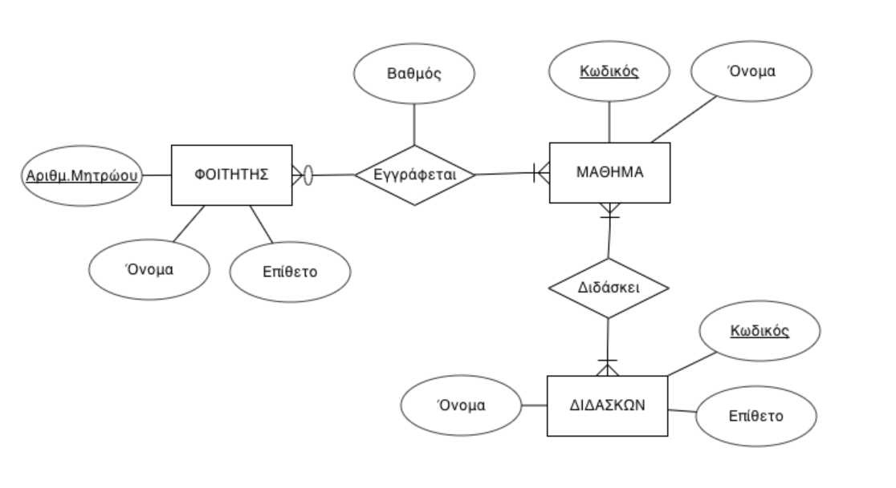

# Εισαγωγή στις βάσεις δεδομένων και την SQLite

## Ελληνικό Ανοικτό Πανεπιστήμιο ΘΕ ΠΛΗ-ΠΡΟ


## Νίκος Αβούρης, Ιούνιος 2021

<p style="page-break-before: always">


## Περίληψη

Στην ενότητα αυτή θα γίνει μια σύντομη εισαγωγή στο αντικείμενο των βάσεων δεδομένων, και στη σύνδεση μιας βάσης δεδομένων με ένα πρόγραμμα Python.

Θα εστιάσουμε ιδιαίτερα σε ένα μοντέλο οργάνωσης δεδομένων που λέγεται **σχεσιακό μοντέλο**, στη γλώσσα που έχει δημιουργηθεί για να υποστηρίζει πράξεις σε δεδομένα που είναι οργανωμένα με αυτό το μοντέλο, μια σύντομη εισαγωγή στη γλώσσα **SQL (structured query language)**. Στα παραδείγματά μας, θα χρησιμοποιήσουμε τη βάση δεδομένων [SQLite](https://www.sqlite.org/index.html), μια ελαφρά μηχανή σχεσιακών βάσεων δεδομένων, που έχει ιδιαίτερη διάδοση και είναι εύκολη στην εγκατάσταση και χρήση.

## 1. Εισαγωγή

Παρουσιάζεται συχνά η ανάγκη για μόνιμη αποθήκευση δεδομένων ενός προγράμματος Python, δηλαδή δεδομένων που θα είναι διαθέσιμα και την επόμενη φορά που θα χρησιμοποιήσουμε το πρόγραμμα. 

Ένας συνηθισμένος τρόπος να αποθηκεύσουμε δεδομένα μόνιμα, είναι σε ένα **αρχείο** που βρίσκεται στο δίσκο του υπολογιστή, και το οποίο μπορούμε να ανοίξουμε με την συνάρτηση `open(filename, 'r')`. 

Όμως, όταν τα δεδομένα είναι σύνθετα και μεγάλου όγκου, έχουμε ως εναλλακτική επιλογή, να τα αποθηκεύσουμε σε μια **βάση δεδομένων (data base)**, δηλαδή σε μια συλλογή λογικά συσχετιζόμενων δεδομένων, η οποία βρίσκεται σε ένα διαθέσιμο μέσο αποθήκευσης, σε έναν δίσκο του υπολογιστή ή σε κάποιον εξυπηρετητή, και στα οποία έχουν πρόσβαση εφαρμογές, όπως προγράμματα Python.

Στη συνέχεια θα δούμε πώς δημιουργείται μια Βάση Δεδομένων, πώς γεμίζει με δεδομένα και ποιος είναι ο τρόπος πρόσβασης στα δεδομένα αυτά και διαχείρισής τους από την Python. Θα χρησιμοποιήσουμε για το σκοπό αυτό τη βιβλιοθήκη [sqlite3](https://docs.python.org/3/library/sqlite3.html), την βιβλιοθήκη της τυπικής διανομής της Python που επιτρέπει τη διασύνδεση με βάση δεδομένων SQLite, μια δημοφιλή βάση δεδομένων που ακολουθεί το σχεσιακό μοντέλο.

Το πρόβλημα που θα προσπαθήσουμε να λύσουμε είναι η ανάπτυξη μιας εφαρμογής που διαχειρίζεται τις βαθμολογίες ενός Πανεπιστημιακού Τμήματος, δηλαδή που διαχειρίζεται στοιχεία των φοιτητών και των μαθημάτων που διδάσκονται. Η εφαρμογή μάς επιτρέπει να αποθηκεύσουμε πληροφορίες για τους φοιτητές, τα μαθήματα, κλπ, και να παρουσιάσουμε τις πληροφορίες αυτές με τρόπους που έχουν καταγραφεί στις απαιτήσεις του προβλήματος, να τυπώσουμε την καρτέλα ενός φοιτητή με τις βαθμολογίες του, την κατάσταση βαθμολογιών ενός συγκεκριμένου μαθήματος, κλπ.

Με την ευκαιρία του προβλήματος αυτού, θα δούμε τη διαδικασία σχεδίασης της βάσης δεδομένων και εν γένει μιας εφαρμογής που συνδέεται με μια βάση δεδομένων.

<p style="page-break-before: always">

## 2. Σχεδίαση μιας βάσης δεδομένων

Ο σχεδιασμός μιας βάσης δεδομένων είναι μια σύνθετη διαδικασία. Οι μεγάλες βάσεις δεδομένων στα πληροφοριακά συστήματα των δημόσιων οργανισμών και των μεγάλων επιχειρήσεων χρειάζονται χρόνια για να αναπτυχθούν και η συντήρησή τους απαιτεί τη δουλειά μεγάλων ομάδων ανθρώπων. Η πιο δύσκολη δουλειά είναι η αρχική σχεδίαση, που ξεκινάει από την περιγραφή και ανάλυση των αναγκών ενός μικρόκοσμου, την καταγραφή των απαιτήσεων και την επιλογή των δεδομένων που θα αποθηκευτούν στη βάση δεδομένων.

Ένας συνηθισμένος τρόπος αναπαράστασης των δεδομένων είναι μέσω ενός μοντέλου των κύριων **οντοτήτων** που εμφανίζονται στον μικρόκοσμο, των **ιδιοτήτων** τους, και των **συσχετίσεων** μεταξύ των οντοτήτων αυτών.

Ας πάρουμε το πρόβλημα του πληροφοριακού συστήματος ενός πανεπιστημιακού τμήματος. Αρχικά θα πρέπει να αναζητήσουμε τις κύριες οντότητες, τις ιδιότητες και τις συσχετίσεις τους.

Στο πανεπιστημιακό τμήμα οι κύριες οντότητες είναι ο *φοιτητής* και το *μάθημα*. Η συσχέτισή τους αποτυπώνεται με τη λέξη *“Εγγράφεται”* (Ο φοιτητής Χ εγγράφεται στο μάθημα Υ). Είναι φανερό ότι σε κάθε μάθημα εγγράφονται πολλοί φοιτητές και κάθε φοιτητής, κάθε χρονιά, εγγράφεται σε πολλά μαθήματα. Αυτό αποτυπώνεται ως **συσχέτιση *πολλά προς πολλά***.

Εν γένει, υπάρχουν εκτός από τις συσχετίσεις πολλά-προς-πολλά που είναι οι πιο συνηθισμένες, και συσχετίσεις *ένα-προς-πολλά*, και *ένα-προς-ένα*. Για παράδειγμα οι *γεωγραφικοί τόποι* σχετίζονται με τους *πολίτες* με τη σχέση *“γεννήθηκε”* που είναι συσχέτιση *ένα προς πολλά* (Ο πολίτης Χ γεννήθηκε στον τόπο Υ), αφού ο πολίτης γεννήθηκε σε ένα μόνο τόπο, αλλά στον ίδιο τόπο έχουν γεννηθεί πολλοί πολίτες.

### 2.1 Διαγράμματα οντοτήτων-συσχετίσεων

Σε ένα **διάγραμμα οντοτήτων-συσχετίσεων (entity-relationship diagram ERD)** ενός μικρόκοσμου, οι οντότητες αποτυπώνονται ως ορθογώνια και οι συσχετίσεις ως ρόμβοι, ενώ οι ιδιότητες (τα γνωρίσματα) των οντοτήτων ή των συσχετίσεων ως οβάλ. 

Ως παράδειγμα, στο παρακάτω σχήμα αποτυπώνονται οι βασικές οντότητες και η συσχέτισή τους για τον μικρόκοσμο ενός πανεπιστημιακού τμήματος, το οποίο θα σχολιάσουμε στη συνέχεια. Το διάγραμμα που ακολουθεί σχεδιάστηκε με το εργαλείο https://erdplus.com/standalone


Η διαδικασία αναζήτησης των οντοτήτων ενός προβλήματος και των **χαρακτηριστικών γνωρισμάτων (attributes)** τους, καθώς και των συσχετίσεών τους, πρέπει να συνεχιστεί. Θα πρέπει να επιλέξουμε τα γνωρίσματα αυτά με κριτήριο ποιες πληροφορίες θα είναι χρήσιμες για το πρόβλημα που επιθυμούμε να λύσουμε, αφού τα γνωρίσματα περιγράφουν τις πληροφορίες που θα αποθηκευτούν στη βάση δεδομένων. Για παράδειγμα, είναι σκόπιμο πέραν του αριθμού μητρώου, ονόματος και επίθετου ενός φοιτητή, να αποθηκεύσουμε κάποια στοιχεία επικοινωνίας (εμαιλ, κινητό, κλπ) για κάθε φοιτητή; Η απάντηση βρίσκεται στις απαιτήσεις χρήσης. Αν το πληροφοριακό σύστημα χρησιμοποιείτει μόνο για αποθήκευση βαθμολογιών, και ανακοίνωση των αποτελεσμάτων των εξετάσεων, η απάντηση είναι όχι, αν χρησιμοποιείται και για επικοινωνία με τους φοιτητές, τότε θα πρέπει το στοιχείο αυτό να προστεθεί στην οντότητα φοιτητής.

Είναι φανερό, ότι προβλήματα που πρέπει να αντιμετωπίσει ο σχεδιαστής ενός πληροφοριακού συστήματος σχετίζονται με τον βαθμό λεπτομέρειας που θα πρέπει να φτάσει, αλλά και με τη δομή, αφού για παράδειγμα, συχνά δεν είναι σαφές αν ένα γνώρισμα είναι οντότητα με δικά της γνωρίσματα ή πρέπει να παραμείνει γνώρισμα.  

Στο διάγραμμα του παραδείγματός μας, φαίνονται δύο οντότητες που αντιπροσωπεύουν τις βασικές έννοιες του προβλήματος, τον ΦΟΙΤΗΤΗ (Student), και το ΜΑΘΗΜΑ (Course). Κάθε μια από τις οντότητες αυτές, αλλά και οι συσχετίσεις τους, χαρακτηρίζεται από κάποια γνωρίσματα (ιδιότητες) που αναπαριστώνται ως οβάλ σχήματα. Για παράδειγμα, για την οντότητα ΦΟΙΤΗΤΗΣ τα γνωρίσματα είναι το Όνομα, Επίθετο και Αριθμός Μητρώου. Σε κάθε οντότητα μια από τις ιδιότητες είναι το **Πρωτεύον Κλειδί (Primary key)** που παίρνει αναγκαστικά διαφορετικές τιμές για κάθε στιγμιότυπο της οντότητας. Στο διάγραμμα τα πρωτεύοντα κλειδιά είναι υπογραμμισμένα γνωρίσματα. Για τον φοιτητή, το πρωτεύον κλειδί είναι το γνώρισμα *Αριθμός Μητρώου*, ενώ για το μάθημα είναι το γνώρισμα *Κωδικός*.
Το διάγραμμα αυτό είναι αρκετά απλουστευτικό της πραγματικότητας, για παράδειγμα λείπουν οι διδάσκοντες του κάθε μαθήματος, οι διδακτικές μονάδες, η περιγραφή των μαθημάτων, άλλα στοιχεία των φοιτητών, κλπ.

Ιδιαίτερη σημασία έχουν οι συσχετίσεις μεταξύ των οντοτήτων, που εκφράζονται με ρόμβους στο διάγραμμα οντοτήτων-συσχετίσεων και με ρήματα στη λεκτική περιγραφή της συσχέτισης. Ο Φοιτητής **"εγγράφεται"** σε ένα Μάθημα. Αυτή είναι μια συσχέτιση τύπου ”πολλά προς πολλά”, όπως έχει ήδη αναφερθεί. Το στοιχείο αυτό αποτυπώνεται στη σύνδεση μεταξύ των οντοτήτων. Προσέξτε τις απολήξεις των γραμμών συσχέτισης στο σχήμα. Όταν η απόληξη έχει πολλές γραμμές στην άκρη (όπως τα πόδια της χήνας) αυτό σημαίνει ότι επιτρέπεται ένα αντικείμενο της άλλης οντότητας να συσχετιστεί με πολλά της οντότητας στην οποία καταλήγει η απόληξη. 

Επίσης αν πριν την απόληξη υπάρχει μια κάθετη γραμμή, αυτό δηλώνει ολική συμμετοχή, δηλαδή ότι ο ελάχιστος αριθμός στιγμιότυπων της οντότητας με τον οποίο μπορεί να συσχετιστεί ένα αντικείμενο της άλλης οντότητας είναι ένα (1), ενώ αν είναι ένας κύκλος, ότι είναι μηδέν (0).

#### 2.1.Α Άσκηση αυτο-αξιολόγησης
Σχολιάστε στο παραπάνω διάγραμμα τη συμμετοχή της οντότητας ΦΟΙΤΗΤΗΣ και της οντότητας ΜΑΘΗΜΑ στη σχέση "Εγγράφεται".

**Απάντηση**: 
Και οι δύο οντότητες συνδέονται με πολλά στιγμιότυπα της συσχετιζόμενης οντότητας, δηλαδή κάθε φοιτητής εγγράφεται σε πολλά μαθήματα και σε κάθε μάθημα εγγράφονται πολλοί φοιτητές. Η συμμετοχή του φοιτητή στη συσχέτιση είναι ολική, δεν νοείται φοιτητής που δεν έχει γραφτεί σε ένα έστω μάθημα, όμως η συμμετοχή του μαθήματος στη σχέση είναι μερική, δηλαδή επιτρέπεται να υπάρχουν μαθήματα που δεν έχουν φοιτητές (προαιρετικά μαθήματα που δεν έχει διαλέξει κανείς φοιτητής). Η ερώτηση είναι, πώς προκύπτουν αυτές οι σχέσεις; Η απάντηση είναι από την ανάλυση των χαρακτηριστικών του μικρόκοσμου, που βρίσκει κανείς στην εκφώνηση, ή στην ανάλυση του προβλήματος.

#### 2.1.Β Άσκηση αυτο-αξιολόγησης
Εξηγήστε γιατί το γνώρισμα *βαθμός* έχει συνδεθεί με τη συσχέτιση "Εγγράφεται"

**Λύση**

Μια πρώτη προσέγγιση στην αποτύπωση της ιδιότητας *βαθμός* που παίρνει ένας φοιτητής σε ένα μάθημα, είναι να θεωρηθεί ως ιδιότητα του μαθήματος.

Όμως γρήγορα αντιλαμβανόμαστε ότι επειδή πολλοί φοιτητές γράφονται στο μάθημα, δεν είναι δυνατόν να θεωρήσουμε τον βαθμό ενός φοιτητή ως ιδιότητα του μαθήματος, χωρίς να αναφερθούμε σε ποιον φοιτητή αφορά. 

Μια δεύτερη προσέγγιση είναι ο βαθμός να είναι ιδιότητα του φοιτητή, αλλά και εδώ με τον ίδιο συλλογισμό κατανοούμε ότι ο κάθε φοιτητής παίρνει πολλούς βαθμούς άρα χρειάζεται ο κάθε βαθμός να έχει την πρόσθετη πληροφορία σχετικά με το ποιο μάθημα αφορά.

Μια άλλη θεώρηση είναι να συνδέσουμε την ιδιότητα "βαθμός¨ με τη συσχέτιση φοιτητή-μαθήματος, όπως φαίνεται στο διάγραμμα.

Τέλος μια εναλλακτική θεώρηση θα μπορούσε να είναι ο βαθμός να αποτυπωθεί ως ξεχωριστή οντότητα "Εξέταση" με ιδιότητα τη βαθμολογία και την εξεταστική περίοδο (Ιούνιος, Σεπτέμβριος, κλπ.) και να συνδεθεί μέσω τριαδικής συσχέτισης με τη σχέση "Εγγράφεται". Αυτή η τελευταία λύση είναι πιο σύνθετη, παρουσιάζει όμως κάποια πλεονεκτήματα.

### 2.1.Γ Άσκηση αυτο-αξιολόγησης

Ζητείται να επεκτείνετε το διάγραμμα οντοτήτων-συσχετίσεων της προηγούμενης ενότητας, με την εισαγωγή των διδασκόντων σε αυτό.

**Λύση**

Ο **διδάσκων** είναι οντότητα (*σημείωση*: θα μπορούσε κάποιος να θεωρήσει αρχικά ότι ο διδάσκων είναι γνώρισμα του μαθήματος, όμως αυτή η λύση έχει πολλά προβλήματα, ένα κριτήριο είναι ότι ο διδάσκων έχει και αυτός χαρακτηριστικά γνωρίσματα, όπως όνομα, αριθμό ταυτότητας, τηλέφωνο, κλπ), ενώ επειδή ο ίδιος διδάσκων διδάσκει πολλά μαθήματα, η πληροφορία που τον αφορά επαναλαμβάνεται σε κάθε μάθημα. Στη συνέχεια συνδέουμε τον διδάσκοντα με την οντότητα μάθημα. Η συσχέτιση αυτή διαπιστώνουμε ότι είναι σχέση πολλά-προς-πολλά αφού ένα μάθημα μπορεί να συνδιδάσκεται από πολλούς καθηγητές, ενώ σε ένα καθηγητή συνήθως έχουν ανατεθεί πολλά μαθήματα προς διδασκαλία. Επίσης η συμμετοχή του Διδάσκοντα και του Μαθήματος στη σχέση "Διδάσκει" είναι ολική και στις δύο περιπτώσεις (δεν υπάρχουν μαθήματα χωρίς διδάσκοντες, και διδάσκοντες που δεν διδάσκουν κανένα μάθημα).

Τέλος θα πρέπει να αποφασίσουμε ποια γνωρίσματα χαρακτηρίζουν τον καθηγητή. Για το δικό μας πρόβλημα, μόνο το όνομα-επώνυμο του καθηγητή και ένας μοναδικός κωδικός καθηγητή, ως πρωτεύον κλειδί, αρκούν. Μάλιστα ο κωδικός καθηγητή δεν είναι ιδιότητα που έχει νόημα στον φυσικό κόσμο, άρα αφήνουμε τη βάση δεδομένων να γεννήσει τιμές αυτόματα με το χαρακτηριστικό auto-increment.
Το τελικό διάγραμμα της εφαρμογής μετά την ανάλυση αυτή φαίνεται στη συνέχεια.



<p style="page-break-before: always">

## 3. Εισαγωγή στις σχεσιακές βάσεις δεδομένων και την SQL

Στην ενότητα αυτή θα δούμε τις βασικές αρχές που διέπουν το **σχεσιακό μοντέλο (relational model)** οργάνωσης βάσεων δεδομένων, και τις βασικές εντολές της γλώσσας SQL, επίσης θα δούμε στη συνέχεια τη βάση δεδομένων SQLite ως παράδειγμα.

Το σχεσιακό μοντέλο βάσεων δεδομένων, και η γλώσσα του, η SQL είναι από τις πιο παλιές και ευρέως διαδεδομένες τεχνολογίες στους υπολογιστές. Το μοντέλο αυτό ορίστηκε πρώτη φορά στη δεκαετία του 1970 και παραμένει μέχρι σήμερα ο πιο δημοφιλής τρόπος οργάνωσης δεδομένων σε βάσεις δεδομένων. Στηρίζεται στην ιδέα οργάνωσης των δεδομένων σε συσχετισμένους πίνακες (οι πίνακες ονομάζονται **σχέσεις-relations**, εξού και ο όρος σχεσιακό μοντέλο). Κάθε πίνακας περιέχει εγγραφές. Το σχεσιακό μοντέλο συνοδεύεται από μια γλώσσα χειρισμού και ορισμού δεδομένων, την SQL. Η γλώσσα αυτή, που είναι γλώσσα ειδικού σκοπού, περιλαμβάνει τις εξής εντολές:
 
Εντολές Ορισμού Δεδομένων (DDL - Data Definition Language):
* `CREATE` 	Δημιουργεί ένα νέο πίνακα, όψη ενός πίνακα (εικονικό πίνακα), ή άλλο αντικείμενο στη Β.Δ..
* `ALTER` 	Αλλάζει ένα υπάρχον αντικείμενο της Β.Δ., όπως ένα πίνακα.
* `DROP` 	Διαγράφει ένα πίνακα, μία όψη ενός πίνακα, ή κάποιο άλλο αντικείμενο στη Β.Δ..
 
Εντολές Χειρισμού Δεδομένων (DML - Data Manipulation Language):
* `INSERT` 	Δημιουργεί μία εγγραφή.
* `UPDATE` 	Τροποποιεί εγγραφές.
* `DELETE` 	Διαγράφει εγγραφές.
 
Εντολή σύνταξης ερωτημάτων (DQL - Data Query Language):
* `SELECT` 	Ανακτά ορισμένες εγγραφές από έναν ή περισσότερους πίνακες. 

Στη συνέχεια μέσα από παραδείγματα, θα δούμε την ακριβή σύνταξη των εντολών αυτών, ενώ για μια πιο εκτενή εισαγωγή στη γλώσσα SQL θα πρέπει να μελετήσει κανείς σχετικά turorials, όπως αυτό των [w3schools](https://www.w3schools.com/sql/default.Asp).

Ένα απλό περιβάλλον πειραματισμού με την SQL είναι η σχεσιακή βάση δεδομένων SQLite, για την οποία παραθέτουμε μια σύντομη εισαγωγή.

### 3.1  Εισαγωγή στην SQLite

Η SQLite είναι ένα **σύστημα διαχείρισης σχεσιακών βάσεων δεδομένων (data base management system DBMS)**, δηλαδή ένα λογισμικό το οποίο αποθηκεύει δεδομένα ακολουθώντας το σχεσιακό μοντέλο και την SQL.

H SQLite χρησιμοποιείται ευρέως στις λεγόμενες ενσωματωμένες βάσεις δεδομένων, δεν απαιτεί εξωτερικό εξυπηρετητή, η χρήση της μπορεί να γίνει μέσω γραφικής διεπαφής με χρήση της εφαρμογής [**DB Browser for SQLite**](https://sqlitebrowser.org/), διαθέσιμης για όλα τα λειτουργικά συστήματα. 

Η SQLite  αποθηκεύει μία Β.Δ. σε ένα μόνο αρχείο, το οποίο είναι ανεξάρτητο από το λειτουργικό σύστημα, ενώ απαιτεί πολύ μικρό αποθηκευτικό χώρο, ~700 KB. Η SQLite υλοποιεί το πρότυπο SQL92 (SQL2) της γλώσσας SQL. Υπάρχουν μικρές αποκλήσεις από το πρότυπο, όπως για παράδειγμα, δεν υποστηρίζει κάποιες δευτερεύουσες δυνατότητες, οι οποίες δεν θα χρειαστούν στο παράδειγμά μας, όπως τη δυνατότητα `RIGHT OUTER JOIN` και `FULL OUTER JOIN`, αφού υποστηρίζει μόνο το `LEFT OUTER JOIN` στην πράξη **συνένωσης πινάκων**.
Ακόμη, δεν υποστηρίζει την εντολή `ALTER TABLE`, αλλά υποστηρίζονται οι παραλλαγές RENAME TABLE και ADD COLUMN της εντολής ALTER TABLE. Επίσης οι εντολές `DROP COLUMN`, `ALTER COLUMN`, `ADD CONSTRAINT `δεν υποστηρίζονται. Όμως οι πράξεις αλλαγής της δομής ενός πίνακα ελάχιστα χρησιμοποιούνται στις βάσεις δεδομένων.
Τέλος στις όψεις (VIEWs), δηλαδή στους εικονικούς πίνακες στην SQLite επιτρέπεται μόνο ανάγνωση (read-only). Δεν είναι εφικτό να εκτελεστούν οι δηλώσεις DELETE, INSERT, ή UPDATE σε μία όψη. 

### 3.2  Εγκατάσταση της SQLite

Ο πιο απλός τρόπος εγκατάστασης και χρήσης της SQLite είναι με την εγκατάσταση του γραφικού περιβάλλοντος [DB Browser for SQLite](https://sqlitebrowser.org/), ακολουθώντας τις σχετικές οδηγίες εγκατάστασης ανάλογα με το λειτουργικό σας σύστημα.

Αφού ολοκληρωθεί η εγκατάσταση του **DB Browser for SQLite**, θα προχωρήσουμε στην δημιουργία της βάσης δεδομένων University σύμφωνα με την ανάλυση της προηγούμενης ενότητας.

Αρχικά επιλέγουμε "New Database" και αποθηκεύουμε τη βάση δεδομένων σε ένα αρχείο με όνομα `university.db`.

Στη συνέχεια μάς ζητείται να ορίσουμε τους πίνακες (tables) της βάσης δεδομένων μας, όπως περιγράφεται στην επόμενη ενότητα.

### 3.3 Δημιουργία βάσης δεδομένων university.db

Για να δημιουργήσουμε τη βάση δεδομένων θα πρέπει πρώτα να ορίσουμε το **σχήμα της βάσης (schema)**, δηλαδή τους πίνακες και τις συνδέσεις τους. Το σχήμα προκύπτει από μετασχηματισμό του διαγράμματος οντοτήτων-συσχετίσεων που δημιουργήσαμε στην προηγούμενη ενότητα, σε ένα σύνολο από **πίνακες** με **γνωρίσματα**, οι οποίοι συνδέονται μεταξύ τους μέσω ξένων κλειδιών. Για τη βάση δεδομένων university.db, το σχήμα φαίνεται στη συνέχεια.


(το σχήμα έχει δημιουργηθεί με χρήση του https://app.dbdesigner.net/designer/schema/guest_template)

Στο σχήμα αυτό φαίνονται συνολικά πέντε (5) πίνακες: τρεις βασικοί πίνακες (**Students**, **Teachers**, **Courses**), που αντιστοιχούν στις οντότητες *ΦΟΙΤΗΤΗΣ*, *ΔΙΔΑΣΚΩΝ* και *ΜΑΘΗΜΑ*, αντίστοιχα, καθώς και δύο πίνακες συσχέτισης **Enrolled**, **Teaching**, που αντιστοιχούν στις συσχετίσεις *Εγγράφεται* και *Διδάσκει* αντίστοιχα. 

Τα **πρωτεύοντα κλειδιά** φαίνονται με το χαρακτηριστικό σύμβολο στα αριστερά του αντίστοιχου γνωρίσματος.

Τα **ξένα κλειδιά** είναι γνωρίσματα ενός πίνακα, που "αναφέρονται" στα πρωτεύοντα κλειδιά ενός άλλου πίνακα, και έτσι συσχετίζουν τις εγγραφές των δύο πινάκων. Η λέξη "αναφέρονται" σημαίνει, ότι ένα ξένο κλειδί είναι ένα γνώρισμα που παίρνει υπαρκτή τιμή που έχει ήδη το πρωτεύον κλειδί σε ένα πίνακα αναφοράς. Τα ξένα κλειδιά φαίνονται στο διάγραμμα με ένα βέλος που "δείχνει" προς το γνώρισμα στο οποίο αναφέρονται. 

Τα ξένα κλειδιά, που δεν είναι απαραίτητα "κλειδιά" του πίνακα στον οποίο ανήκουν, είναι ιδιαίτερα σημαντικά πεδία, αφού μέσω αυτών συνδυάζεται η πληροφορία που βρίσκεται στους συσχετιζόμενους πίνακες, όπως θα δούμε κατά τις πράξεις συνένωσης πινάκων (JOIN), που αντλούν συσχετιζόμενα δεδομένα από διαφορετικούς πίνακες.

Για κάθε έναν από τους πίνακες του σχήματος, δηλώνουμε τα **Πεδία (Fields)** τους, που είναι οι ιδιότητες που φαίνονται στο διάγραμμα οντοτήτων-συσχετίσεων. 

Για κάθε πεδίο ορίζουμε τον **τύπο δεδομένων** του, οι τύποι που υποστηρίζονται από την SQLite είναι: 
* `TEXT`: Αντιστοιχεί σε αλφαριθμητικές τιμές, στο πρότυπο αντιστοιχεί στον τύπο VARCHAR(n).
* `INTEGER`: αντιστοιχεί στον τύπο δεδομένων INT του προτύπου, και αφορά ακέραιες τιμές αριθμών.
* `FLOAT`: Αφορά πραγματικές τιμές αριθμών.
* `NULL`: Αδιάστατο μέγεθος που οποία αντιστοιχεί σε μη-τιμή.

Θα πρέπει να σημειωθεί ότι το πρότυπο της SQL περιλαμβάνει αρκετούς ακόμη τύπους δεδομένων, μεταξύ των οποίων τον τύπο DATE, TIMESTAMP, κλπ. Για δεδομένα τύπου DATE θα πρέπει να τα αποθηκεύσουμε ως συμβολοσειρές (TEXT) και να τα επεξεργαστούμε, ακολουθώντας τη σύμβαση `'YYYY-MM-DD HH:MM:SS.SSS'`.

Στο περιβάλλον του *DB Browser for SQLite* ορίζουμε τους πίνακες με συμπλήρωση της σχετικής φόρμας δημιουργίας πίνακα, εκεί ζητείται να ορίσουμε τα πεδία του πίνακα, ένα παράδειγμα ακολουθεί για τον πίνακα Student:


Παρατηρούμε ότι καθώς ορίζουμε τα γνωρίσματα του πίνακα, δημιουργείται η αντίστοιχη εντολή SQL δημιουργίας του πίνακα, στο κάτω μέρος της οθόνης, αυτόματα.

Για κάθε πεδίο του πίνακα μπορούμε να επιλέξουμε τον τύπο δεδομένων, καθώς επίσης να επιλέξουμε να ενεργοποιηθεί κάποια από τις επιλογές:
ΝΝ = NOT NULL (δηλαδή υποχρεωτικά πρέπει το πεδίο να πάρει τιμή)
PK = Primary Key (πρωτεύον κλειδί)
AI = Autoincrement, δηλαδή η τιμή δίνεται από την ίδια τη βάση ως αύξων ακέραιος αριθμός
U = Unique, δηλαδή το πεδίο παίρνει διαφορετικές τιμές για κάθε εγγραφή, πρόκειται δηλαδή για δευτερεύον κλειδί, χωρίς όμως να είναι το πρωτεύον κλειδί, που ορίζεται από την επιλογή PK.

Ο κώδικας SQL που παράγεται για τη δημιουργία του πίνακα Students φαίνεται στη συνέχεια:

```sql
CREATE TABLE "Students" (
	"ΑΜ"	INTEGER,
	"NAME"	TEXT NOT NULL,
	"SURNAME"	TEXT NOT NULL,
	PRIMARY KEY("ΑΜ")
);
```

Γενικά η σύνταξη της εντολής CREATE είναι:

```sql
CREATE TABLE <Ονομασία Πίνακα>(
   <Ονομασία Πεδίου> <Τύπος Δεδομένων>,
   <Ονομασία Πεδίου> <Τύπος Δεδομένων>,
   ...
   PRIMARY KEY (A)
);
```

Στη συνέχεια με τον ίδιο τρόπο προχωράμε στη δημιουργία των πινάκων Courses και Professors:

```sql
CREATE TABLE "Courses" (
	"CODE"	TEXT,
	"NAME"	TEXT NOT NULL,
	PRIMARY KEY("CODE")
);

CREATE TABLE "Professors" (
	"ID"	INTEGER,
	"NAME"	TEXT NOT NULL,
	"SURNAME"	TEXT NOT NULL,
	PRIMARY KEY("ID" AUTOINCREMENT)
);
```

Οπως έχουμε ήδη σχολιάσει, οι συσχετίσεις μεταξύ των οντοτήτων του διαγράμματος ERD είναι τύπου πολλά-προς-πολλά, αυτές μετατρέπονται στο σχεσιακό σχήμα, σε **πίνακες συσχέτισης** που περιλαμβάνουν ως ξένα κλειδιά τους κωδικούς των εγγραφών που συσχετίζουν, και ως πρωτεύον κλειδί, το συνδυασμό των κλειδιών των εγγραφών των πινάκων που συσχετίζουν (σύνθετο πρωτεύον κλειδί).

Συνεπώς ο πίνακας **Enrolled** (Εγγράφεται), ορίζεται ως εξής:

```sql
CREATE TABLE "Enrolled" (
	"AM"	INTEGER,
	"CODE"	TEXT,
	"GRADE"	REAL,
	PRIMARY KEY("AM","CODE"),
	FOREIGN KEY("AM") REFERENCES "Student"("ΑΜ"),
	FOREIGN KEY("CODE") REFERENCES "Course"("CODE")
);
```

Παρατηρούμε ότι ο πίνακας αυτός έχει ένα σύνθετο πρωτεύον κλειδί που παραρτίζεται από τα γνωρίσματα AM, και CODE, καθένα από τα οποία είναι ξένο κλειδί, δηλαδή παίρνει τιμές από τον αντίστοιχο πίνακα στον οποίο αναφέρεται. Αυτός είναι ο μηχανισμός για συσχέτιση των πινάκων. Επίσης στον πίνακα αυτόν προσθέτουμε το πεδίο GRADE που είναι το γνώρισμα της συσχέτισης, (Βαθμός).

Με παρόμοιο τρόπο ορίζουμε τον πίνακα **Teaching** που συσχετίζει τις εγγραφές του πίνακα Professors με αυτές του πίνακα Courses.

```sql
CREATE TABLE "Teaching" (
	"ID"	INTEGER,
	"CODE"	TEXT,
	PRIMARY KEY("ID","CODE"),
	FOREIGN KEY("ID") REFERENCES "Professors"("ID"),
	FOREIGN KEY("CODE") REFERENCES "Courses"("CODE")
);
```
Θα πρέπει να σημειωθεί ότι η εισαγωγή του περιορισμού ξένου κλειδιού είναι κάπως σύνθετη στο περιβάλλον του DB Browser for SQLite.

Η διαδικασία προβλέπει τα παρακάτω βήματα:

1. Αρχικά ορίζουμε τα πεδία του πίνακα, στην καρτέλα Fields, πχ τα πεδία ID και CODE.
2. Στη συνέχεια ορίζουμε στην καρτέλα Constraints τον περιορισμό Foreign key για τα αντίστοιχα πεδία, 
3. τέλος επιστρέφουμε στην καρτέλα Fields, και εισάγουμε τους πίνακες αναφοράς των ξένων κλειδιών, πχ το γεγονός ότι το πεδίο ID αναφέρεται στον πίνακα Professors('ID').

Ένα στιγμιότυπο της διαδικασίας αυτής φαίνεται στη συνέχεια:


Θα πρέπει να σημειωθεί οτι οι παραπάνω εντολές SQL δημιουργίας μιας βάσης δεδομένων, μπορούν στο περιβάλλον DB Browser να δοθούν ως εντολές μέσω της καρτέλας "Execute SQL" του DB Browser. 

Στη συνέχεια θα δούμε πώς μπορούμε να εισάγουμε δεδομένα ή να τροποποιήσουμε τα δεδομένα στους πίνακες που δημιουργήσαμε.

#### 3.3.1 Άσκηση αυτο-αξιολόγησης

Ποια η διαφορά μεταξύ πρωτεύοντος και ξένου κλειδιού σε ένα πίνακα;
Σημειώστε όλες τις απαντήσεις που είναι σωστές:
1. Είναι δύο κλειδιά εκ των οποίων, το ένα δείχνει προς ένα άλλο πίνακα
2. Το πρωτεύον κλειδί είναι μοναδικό γνώρισμα του πίνακα, ενώ ξένα κλειδιά μπορεί να έχουμε πολλά
3. Το πρωτεύον κλειδί παίρνει μοναδικές τιμές, ενώ το ξένο κλειδί όχι απαραίτητα
4. Το πρωτεύον κλειδί μπορεί να είναι σύνθετο, ενώ το ξένο κλειδί όχι.

**Απάντηση**
Η μοναδική σωστή απάντηση είναι η 3. Σύντομο σχόλιο στις άλλες απαντήσεις:
1. Η απάντηση είναι εσφαλμένη, το ξένο κλειδί δεν είναι κλειδί, δηλαδή δεν παίρνει απαραίτητα διακριτές τιμές, ενώ μπορεί να πάρει και την τιμή NULL.
2. Το πρωτεύον κλειδί δεν είναι απαραίτητα μοναδικό γνώρισμα, γιατί επιτρέπεται να έχουμε σύνθετα πρωτεύοντα κλειδιά που αποτελούνται από πολλά γνωρίσματα
3. Σωστή απάντηση, το ξένο κλειδί επειδή δεν είναι κλειδί μπορεί να μην παίρνει μοναδικές τιμές.
4. Ως προς το πρώτο σκέλος, σωστά, όμως και το ξένο κλειδί μπορεί να είναι σύνθετο (να απαρτίζεται από πολλά πεδία) αν το πεδίο αναφοράς του είναι επίσης σύνθετο.

Στην επόμενη ενότητα θα δούμε τις εντολές INSERT, UPDATE, DELETE της SQL, με τις οποίες μπορούμε να εισάγουμε ή να τροποποιήσουμε τα δεδομένα μιας βάσης δεδομένων.
Στο περιβάλλον του DB Browser, θα μεταβούμε στην καρτέλα "Execute SQL", όπου μπορούμε να εκτελέσουμε εντολές SQL.

### 3.4 Εισαγωγή δεδομένων, εντολή INSERT

Έστω ότι ο φοιτητής *Αδαμάντιος Κοραής*, με αριθμό μητρώου *101* είναι ένας φοιτητής του Πανεπιστημίου μας. Για εισαγωγή της εγγραφής αυτής στον πίνακα Students θα χρησιμοποιήσουμε την εντολή της SQL `INSERT`.

```sql
INSERT INTO <Ονομασία Πίνακα>
VALUES (<Δεδομένο Πεδίου_1>, <Δεδομένο Πεδίου_2>, ..., <Δεδομένο Πεδίου_n>);
```
Θα πρέπει τα `<Δεδομένα Πεδίου_x>` να ανστιστοιχούν ένα προς ένα στα πεδία που έχουν οριστεί στην εντολή CREATE TABLE του αντίστοιχου πίνακα.

Συνεπώς η εισαγωγή του φοιτητή μας θα γίνει με την εντολή:

```sql
INSERT INTO Students VALUES( 101, "Αδαμάντιος", "Κοραής");
```
Εδώ θα πρέπει να σημειωθεί ότι η εντολή αυτή θα αποτύχει αν ο αριθμός μητρώου φοιτητή 101 υπάρχει ήδη στη βάση δεδομένων, με διαγνωστικό μήνυμα: UNIQUE constraint failed: Students.ΑΜ

Με παρόμοιο τρόπο εισάγουμε το μάθημα "Βάσεις Δεδομένων" με κωδικό "Γ703" στον πίνακα των μαθημάτων Courses:

```sql
INSERT INTO Courses VALUES( "Γ703", "Βάσεις Δεδομένων");
```


Με παρόμοιο τρόπο μπορούμε να εισάγουμε δεδομένα για τους καθηγητές και τα μαθήματα που αυτοί αναλαμβάνουν να διδάξουν.

Κατά την εισαγωγή δεδομένων σε μια βάση δεδομένων γίνονται διάφοροι έλεγχοι, που σχετίζονται με τον τρόπο που έχουν οριστεί τα πεδία και οι πίνακες της βάσης δεδομένων.

Πιθανοί έλεγχοι είναι:
* *Έλεγχος πεδίου τιμής* γνωρίσματος (η τιμή πρέπει να είναι σύμφωνη με τον τύπο του γνωρίσματος, TEXT, FLOAT, κλπ)
* *Έλεγχος υποχρεωτικής τιμής* γνωρίσματος, για τα γνωρίσματα για τα οποία έχει οριστεί ότι δεν μπορούν να πάρουν τιμή NULL, ελέγχεται αν έχει δοθεί τιμή
* *Έλεγχος πρωτεύοντος κλειδιού*, ελέγχεται ότι το γνώρισμα ή ο συνδυασμός γνωρισμάτων του πρωτεύοντος κλειδιού είναι μοναδικός και μη NULL
* *Έλεγχος δευτερευόντων κλειδιών*, για άλλα γνωρίσματα πέραν του πρωτεύοντος κλειδιού, για τα οποία έχει οριστεί οτι παίρνουν μοναδικές τιμές, (UNIQUE) γίνεται έλεγχος αν η τιμή που δίνεται υπάρχει ήδη
* *Έλεγχος ξένων κλειδιών*, για τα ξένα κλειδιά, αν υπάρχουν, γίνεται έλεγχος αν η τιμή τους υπάρχει στο πεδίο στο οποίο αναφέρονται (αυτός ο έλεγχος είναι γνωστός ως έλεγχος αναφορικής ακεραιότητας).

#### 3.4.1.A Άσκηση αυτο-αξιολόγησης

Έστω πίνακας που ορίζεται ως εξής:
```sql
CREATE TABLE "Students" (
	"ΑΜ"	INTEGER,
	"NAME"	ΤΕΧΤ NOT NULL,
	"SURNAME"	TEXT NOT NULL,
	PRIMARY KEY("ΑΜ")
);
```
Κατά την εντολή `INSERT` στον πίνακα αυτόν, ποιοι από τους παρακάτω έλεγχους θα γίνουν; Σημειώστε όλες τις σωστές απαντήσεις.

1. Έλεγχος μοναδικότητας τιμής του πεδίου AM
2. Έλεγχος υποχρεωτικής τιμής του πεδίου AM
3. Έλεγχος υποχρεωτικής τιμής του πεδίου NAME
4. Έλεγχος υποχρεωτικής τιμής του πεδίου SURNAME
5. Έλεγχος μοναδικότητας τιμής του πεδίου NAME
6. Έλεγχος ξένου κλειδιού του πεδίου AM
7. Έλεγχος πεδίου τιμής του πεδίου ΑΜ
8. Έλεγχος πεδίου τιμής του πεδίου NAME
9. Έλεγχος πεδίου τιμής του πεδίου SURNAME

**Απάντηση:**
Οι σωστές απαντήσεις είναι οι 1,2,3,4,7,8,9
Σχόλιο:
* Η απάντηση 5 είναι λάθος γιατί δεν υπάρχει περιορισμός μοναδικότητας για το πεδίο NAME
* Η απάντηση 6 είναι επίσης λάθος γιατί το πεδίο ΑΜ δεν είναι ξένο κλειδί (δεν αναφέρεται σε κάποιο άλλο γνώρισμα), άρα δεν υπάρχει λόγος να γίνει αυτός ο έλεγχος.

#### 3.4.1.B Άσκηση αυτο-αξιολόγησης

Έστω ότι θέλουμε να δηλώσουμε ότι ο φοιτητής Αδαμάντιος Κοραής έχει εγγραφεί στο μάθημα Βάσεις Δεδομένων, ποια είναι η εντολή εισαγωγής του στον αντίστοιχο πίνακα;

**Απάντηση:**
Η εισαγωγή του φοιτητή στον αντίστοιχο πίνακα θα γίνει με την εντολή INSERT στον πίνακα Enrolled. Αναζητάμε στην δήλωση του πίνακα αυτού τα γνωρίσματά του, αυτά είναι ID, CODE, GRADE.
Γνωρίζουμε τον αριθμό μητρώου του φοιτητή ID, τον κωδικό του μαθήματος Βάσεις Δεδομένων που είναι "Γ703", όμως δεν γνωρίζουμε τον βαθμό του στο μάθημα (λογικό γιατί μόλις γράφτηκε), οπότε η εντολή εισαγωγής του στον πίνακα είναι:

```sql
INSERT INTO Enrolled VALUES( 101, "Γ703", NULL);
```
Εδώ παρατηρούμε στο γνώρισμα GRADE θα δώσουμε την τιμή NULL για τον βαθμό, αφού αυτός δεν είναι ακόμη γνωστός.


### 3.5 Τροποποίηση εγγραφών, εντολή UPDATE

Επίσης μια χρήσιμη εντολή της SQL είναι η εντολή τροποποίησης μιας εγγραφής που ήδη υπάρχει, αυτή είναι η εντολή UPDATE που συντάσσεται ως εξής:

```sql
UPDATE <Ονομασία Πίνακα> SET <Ονομασία Πεδίου> = <Νέα Τιμή>
WHERE (<Κλειδί Πίνακα> = <Τιμή Κλειδιού>);
```
Αν δεν υπάρχει το προαιρετικό σκέλος WHERE τότε η αλλαγή θα γίνει σε όλες τις εγγραφές του πίνακα.

**Παράδειγμα**
Αν υποθέσουμε ότι ο κ. Κοραής βαθμολογήθηκε στο μάθημα Βάσεις δεδομένων και θέλουμε να εισάγουμε τη βαθμολογία του, που είναι 8.5, αυτό μπορεί να γίνει με την εντολή:

```sql
UPDATE Enrolled SET grade = 8.5; WHERE CODE="Γ703" AND ID=101;
```
Η εντολή αυτή επίσης συνοδεύεται από αντίστοιχους ελέγχους, όπως αυτοί της εντολής INSERT, ανάλογα με τους περιορισμούς των πεδίων στα οποία αναφέρεται η UPDATE. Μια ιδιαίτερη περίπτωση ελέγχου, είναι η αλλαγή της τιμής ενός πρωτεύοντος κλειδιού στο οποίο αναφέρονται αλλοι πίνακες μέσω ξένου κλειδιού, αν υπάρχουν ήδη εγγραφές, σε αυτή την περίπτωση πρέπει να ελέγξουμε αν με τη αλλαγή της τιμής του πρωτεύοντος κλειδιού, κάποια ξένα κλειδιά μείνουν ορφανά, δηλαδή αναφέρονται πλέον σε ανύπαρκτη τιμή.

#### 3.4.1 Άσκηση αυτο-αξιολόγησης

Έστω ότι θέλουμε να τροποποιήσουμε το όνομα ενός μαθήματος, το μάθημα με κωδικό "Γ703", "Βάσεις Δεδομένων", θα επιθυμούσαμε να τροποποιηθεί ως "Εισαγωγή στις Βάσεις Δεδομένων".

**Απάντηση:**
Η εντολή είναι:

```sql
UPDATE Courses SET NAME = "Εισαγωγή στις Βάσεις Δεδομένων"; WHERE CODE="Γ703";
```


### 3.6 Διαγραφή εγγραφών, εντολή DELETE

Τέλος αν ο κ. Κοραής αποφοιτήσει και επιθυμούμε να διαγράψουμε την εγγραφή από τον πίνακα Students, τότε αυτό γίνεται με την εντολή DELETE της SQL που συντάσσεται ως ακολούθως:

```sql
DELETE FROM <Ονομασία Πίνακα>
WHERE (<Κλειδί Πίνακα> = <Τιμή κλειδιού>);
```
Για το παράδειγμά μας, η εντολή είναι:

```sql
DELETE FROM Students WHERE AM=101;
```

Οι έλεγχοι που γίνονται κατά την εκτέλεση μιας εντολής DELETE είναι λιγότεροι από αυτούς της INSERT, UPDATE. Ο πιο σημαντικός έλεγχος είναι αυτός του ξένου κλειδιού. Αν τυχαίνει να υπάρχει αναφορά μέσω ξένου κλειδιού στην εγγραφή που πρόκειται να διαγραφεί, τότε πιθανόν η διαγραφή να μην επιτραπεί, ή να προκαλέσει παρενέργειες, όπως περαιτέρω διαγραφές. Για παράδειγμα η διαγραφή ενός φοιτητή, πιθανόν προακαλέσει τη διαγραφή των εγγραφών του σε μαθήματα και των αντίστοιχων βαθμών.

#### 3.4.1 Άσκηση αυτο-αξιολόγησης

Πώς θα μπορούσαμε στην πλήρη διαγραφή του περιεχομένου ενός πίνακα Pinax;

**Απάντηση:**
Η εντολή είναι:

```sql
DELETE FROM Pinax WHERE  TRUE;
```

ή εναλλακτικά :

```sql
DELETE FROM Pinax;
```
Θα πρέπει να σημειωθεί ότι στην SQL υπάρχει και η εντολή `DROP TABLE Pinax;` η οποία διαγράφει τον πίνακα από το σχήμα της Βάσης Δεδομένων, ενώ η `DELETE FROM Pinax;` διαγράφει τις εγγραφές του πίνακα.


### 3.7 Ερωτήματα προς τη βάση δεδομένων, η εντολή SELECT

Ως τώρα έχουμε δει πώς δημιουργείται μια βάση δεδομένων, και πώς εισάγουμε/τροποποιούμε/διαγράφουμε δεδομένα από αυτή.

Η χρησιμότητα μιας βάσης δεδομένων φαίνεται όμως κύρια, κατά τη διατύπωση ερωτημάτων μέσω των οποίων ανακτούμε δεδομένα από τη βάση δεδομένων. Η διατύπωση ερωτημάτων στην SQL γίνεται με χρήση της εντολής SELECT.

Η εντολή SELECT συντάσσεται εν γένει ως εξής:

```sql
SELECT <Ονομασία Πεδίων>
FROM <Ονομασία Πινάκων>
WHERE <συνθήκη-επιλογής>;
```

Η εντολή αυτη είναι αρκετά σύνθετη, εδώ θα δείξουμε σταδιακά τη χρήση της, ώστε να ικανοποιηθούν οι ανάγκες της εφαρμογής μας.

Αρχικά εισάγουμε έναν αριθμό ενδεικτικών εγγραφών, με χρήση της INSERT.

```sql
INSERT INTO "Courses" VALUES ('Γ703','Βάσεις Δεδομένων');
INSERT INTO "Courses" VALUES ('Γ501','Λειτουργικά Συστηματα');
INSERT INTO "Courses" VALUES ('Γ802','Προγραμματισμός Διαδικτύου');
INSERT INTO "Professors" VALUES (1,'Ευγένιος','Βούλγαρης');
INSERT INTO "Professors" VALUES (2,'Νεόφυτος','Δούκας');
INSERT INTO "Professors" VALUES (3,'Αθανάσιος','Ψαλίδας');
INSERT INTO "Professors" VALUES (4,'Νίκος','Αβούρης');
INSERT INTO "Students" VALUES (101,'Αδαμάντιος','Κοραής');
INSERT INTO "Students" VALUES (102,'Θεόδωρος','Κολοκοτρώνης');
INSERT INTO "Students" VALUES (103,'Λασκαρίνα','Μπουμπουλίνα');
INSERT INTO "Students" VALUES (104,'Κωνσταντίνος','Κανάρης');
INSERT INTO "Students" VALUES (105,'Μαντώ','Μαυρογένους');
INSERT INTO "Enrolled" VALUES (101,'Γ703',8.5);
INSERT INTO "Enrolled" VALUES (101,'Γ802',6.0);
INSERT INTO "Enrolled" VALUES (102,'Γ802',7.0);
INSERT INTO "Enrolled" VALUES (103,'Γ802',4.5);
INSERT INTO "Enrolled" VALUES (103,'Γ703',4.0);
INSERT INTO "Enrolled" VALUES (105,'Γ703',6.0);
INSERT INTO "Enrolled" VALUES (104,'Γ501',7.0);
INSERT INTO "Enrolled" VALUES (102,'Γ501',6.0);
INSERT INTO "Teaching" VALUES (1,'Γ501');
INSERT INTO "Teaching" VALUES (2,'Γ501');
INSERT INTO "Teaching" VALUES (1,'Γ703');
INSERT INTO "Teaching" VALUES (3,'Γ802');
INSERT INTO "Teaching" VALUES (4,'Γ802');
```

Το περιεχόμενο των πινάκων ως συνέπεια των ανωτέρω εντολών είναι:

**Students**
```text
ΑΜ	NAME	        SURNAME
101	Αδαμάντιος	Κοραής
102	Θεόδωρος	Κολοκοτρώνης
103	Λασκαρίνα	Μπουμπουλίνα
104	Κωνσταντίνος	Κανάρης
105	Μαντώ	        Μαυρογένους
```
**Courses**
```text
CODE	NAME
Γ703	Βάσεις Δεδομένων
Γ501	Λειτουργικά Συστηματα
Γ802	Προγραμματισμός Διαδικτύου
```
**Professors**
```text
ID	NAME	        SURNAME
1	Ευγένιος	Βούλγαρης
2	Νεόφυτος	Δούκας
3	Αθανάσιος	Ψαλίδας
```
**Enrolled**
```text
AM	        CODE	    GRADE
101	        Γ703	    8.5
101	        Γ802	    6.0
102	        Γ802	    7.0
103	        Γ802	    4.5
103	        Γ703	    4.0
105	        Γ703	    6.0
104	        Γ501	    7.0
102	        Γ501	    6.0
```
**Teaching**
```text
ID	CODE
1	Γ501
2	Γ501
1	Γ703
3	Γ802
```

#### 3.7.1 Απλή ανάκτηση πίνακα

Ένα πρώτο παράδειγμα είναι η ανάκτηση των ονομάτων των φοιτητών. Οι φοιτητές είναι καταχωρημένοι ως εγγραφές στον πίνακα Students.

```sql
SELECT NAME, SURNAME
FROM Students;
```
Επιλέγουμε όνομα και επίθετο για τις εγγραφές του πίνακα Students, (χωρίς κριτήριο επιλογής). Η απόκριση:

```text
NAME	SURNAME
Αδαμάντιος	Κοραής
Θεόδωρος	Κολοκοτρώνης
Λασκαρίνα	Μπουμπουλίνα
Κωνσταντίνος	Κανάρης
Μαντώ	Μαυρογένους
```

#### 3.7.2 Ανάκτηση εγγραφών υπό συνθήκη, ο τελεστής LIKE

Αν τώρα δώσουμε την εντολή:

```sql
SELECT NAME, SURNAME
FROM Students
WHERE SURNAME LIKE 'Μ%';
```
Στην περίπτωση αυτή ζητάμε τους φοιτητές που το επίθετό τους αρχίζει από το γράμμα M, οπότε το αποτέλεσμα είναι:

```text
NAME	SURNAME
Λασκαρίνα	Μπουμπουλίνα
Μαντώ	Μαυρογένους
```


#### 3.7.3 Ανάκτηση στοιχείων από συνένωση πινάκων JOIN

Ένα δεύτερο πιο σύνθετο παράδειγμα είναι η ανάκτηση του κατάλογου των φοιτητών που έχουν εγγραφεί σε ένα μάθημα (έστω το μάθημα Βάσεις Δεδομένων) με τους αντίστοιχους βαθμούς τους. Σε αυτή την περίπτωση τα δεδομένα που ζητάμε βρίσκονται σε δύο διαφορετικούς πίνακες, τον πίνακα Students που περιέχει τα στοιχεία των φοιτητών και τον πίνακα Enrolled που περιέχει τις εγγραφές των φοιτητών σε μαθήματα και τους βαθμούς τους.

Αυτό επιτυγχάνεται με την εξής εντολή:

```sql
SELECT Students.NAME, Students.SURNAME, Enrolled.GRADE 
FROM Students JOIN Enrolled ON Students.ΑΜ = Enrolled.AM
WHERE Enrolled.CODE = "Γ703";
```

Αποτέλεσμα:

```text
NAME	    SURNAME	GRADE
Αδαμάντιος	Κοραής	8.5
Λασκαρίνα	Μπουμπουλίνα	4.0
Μαντώ	    Μαυρογένους	6.0
```

Η εντολή αυτή ανακτά το όνομα και επίθετο φοιτητών καθώς και το βαθμό της εγγραφής τους στο μάθημα με κωδικό "Γ703" από τη **συνένωση (JOIN)** των πινάκων Students και Enrolled, με πεδίο συνένωσης τον ΑΜ του φοιτητή και το πεδίο AM του πίνακα Enrolled, με κριτήριο επιλογής μόνο των εγγραφών εκείνων που έχουν κωδικό μαθήματος `Enrolled.CODE = "Γ703"`

Θα πρέπει να σημειωθεί ότι τα ονόματα μεταβλητών με χαρακτήρες όπως "-" ή μη ASCII πρέπει να εισάγονται σε εισαγωγικά.

Η πράξη της συνένωσης που εκφράζεται στο τμήμα FROM της εντολής SELECT, ακολουθεί εν γένει τη σύνταξη 
```sql
<πίνακας-1> JOIN <πίνακας-2> ON πεδίο-1 = πεδίο-2;
```

Επίσης θα πρέπει να αναφερθεί ότι η εντολή συνένωσης μπορεί να εφαρμοστεί διαδοχικά σε πολλούς πίνακες, ενώ υπάρχουν άλλες εκδόσεις της, όπως η `LEFT OUTER JOIN`, κλπ., η περιγραφή των οποίων είναι αντικείμενο πέραν της εισαγωγικής αυτής ενότητας.


#### 3.7.3.Α Άσκηση αυτο-αξιολόγησης

Από την βάση δεδομένων university.db ζητείται να βρεθούν τα ονόματα των μαθημάτων που διδάσκει ο καθηγητής "Βούλγαρης".


**Λύση:**

Θα πρέπει να ανακτήσουμε το όνομα του μαθήματος από τον πίνακα Courses αφού συνενώσουμε τους πίνακες Courses, Teaching και Professors, με τη συνθήκη ότι το επώνυμο του καθηγητή είναι "Βούλγαρης".

```sql
SELECT Courses.NAME
FROM (Courses JOIN Teaching ON Courses.CODE = Teaching.CODE) JOIN Professors ON Teaching.ID = Professors.ID
WHERE Professors.SURNAME = "Βούλγαρης";
```
Τα μαθήματα είναι:

```text
NAME
Λειτουργικά Συστηματα
Βάσεις Δεδομένων
```

#### 3.7.3.Β Άσκηση αυτο-αξιολόγησης

Ζητείται η ανάκτηση της καρτέλας ενός φοιτητή, αν είναι γνωστός ο αριθμός μητρώου του, δηλαδή του καταλόγου των μαθημάτων που έχει γραφτεί ως τώρα και των αντίστοιχων βαθμών.

**Λύση:**

Τα δεδομένα που ζητούνται είναι σε δύο πίνακες, τους Courses, και Enrolled. Μπορούν να ανακτηθούν με την παρακάτω εντολή, για τον φοιτητή με κωδικό 102:

```sql
SELECT Courses.NAME, Enrolled.GRADE
FROM Enrolled JOIN Courses on Enrolled.CODE = Courses.CODE
WHERE Enrolled.AM = 102;
```
Η απόκριση που θα πάρουμε είναι:
```text
NAME	GRADE
Λειτουργικά Συστηματα	6.0
Προγραμματισμός Διαδικτύου	7.0
```
#### 3.7.4 Συναθροιστικές συναρτήσεις, ομαδοποίηση εγγραφών, ταξινόμηση αποτελεσμάτων

Η εντολή `SELECT` επιτρέπει ακόμη ομαδοποίηση των αποτελεσμάτων, ώστε να εφαρμόσουμε κάποια συνάρτηση αθροιστικού χαρακτήρα, όπως οι `SUM, AVG, MIN, MAX` ή `COUNT`.

**Παράδειγμα**: Αν για τον φοιτητή με αριθμό μητρώου 102, που είδαμε πιο πάνω, θέλουμε να μάθουμε τη μέση βαθμολογία του, αυτό γίνεται ως εξής:

```sql
SELECT AVG(GRADE)
FROM Enrolled 
WHERE AM = 102;
```
```text
AVG(GRADE)
6.5
```

Ένα πιο σύνθετο παράδειγμα είναι μια ερώτηση για εύρεση των μέσων βαθμολογιών ανά μάθημα:

```sql
SELECT Enrolled.CODE, Courses.NAME, AVG(GRADE)
FROM Enrolled JOIN Courses on Enrolled.CODE = Courses.CODE
GROUP BY Enrolled.CODE;
```

```text
CODE	NAME	    AVG(GRADE)
Γ501	Λειτουργικά Συστηματα	6.5
Γ703	Βάσεις Δεδομένων	6.16666666666667
Γ802	Προγραμματισμός Διαδικτύου	5.83333333333333
```
Τέλος η SELECT επιτρέπει την ταξινόμηση των αποτελεσμάτων με την εντολή `ORDER BY`. Για παράδειγμα, αν θέλουμε τον κατάλογο των ονομάτων των φοιτητών αλφαβητικά αυτός προκύπτει από την εντολή:

```sql
SELECT NAME, SURNAME
FROM Students
ORDER BY SURNAME;
```

και θα πάρουμε τον κατάλογο:

```text
NAME	SURNAME
Κωνσταντίνος	Κανάρης
Θεόδωρος	Κολοκοτρώνης
Αδαμάντιος	Κοραής
Μαντώ	Μαυρογένους
Λασκαρίνα	Μπουμπουλίνα
```

Αν μάλιστα θέλουμε να πάρουμε τις εγγραφές ταξινομημένες κατά φθίνουσα σειρά θα πρέπει να προσθέσουμε τη λέξη-κλειδί DESC (descending order):

```sql
SELECT NAME, SURNAME
FROM Students
ORDER BY SURNAME DESC;
```

και θα πάρουμε τον κατάλογο:

```text
NAME	SURNAME
Λασκαρίνα	Μπουμπουλίνα
Μαντώ	Μαυρογένους
Αδαμάντιος	Κοραής
Θεόδωρος	Κολοκοτρώνης
Κωνσταντίνος	Κανάρης
```

<p style="page-break-before: always">

## 4. Η εφαρμογή University
Με βάση τον σχεδιασμό της βάσης δεδομένων που είδαμε ως τώρα, στη ενότητα αυτή θα προχωρήσουμε στη ανάπτυξη μιας εφαρμογής που διαχειρίζεται τα δεδομένα αυτά. Είναι η εφαρμογή University. Η εφαρμογή αυτή μάς επιτρέπει να εμφανίσουμε την καρτέλα ενός φοιτητή, τη βαθμολογία ενός μαθήματος και τη συνολική εικόνα για το ακαδημαϊκό έτος, που περιλαμβάνει τους μέσους όρους βαθμολογίας ανά μάθημα. Επίσης θα δούμε λειτουργίες όπως η εισαγωγή/διαγραφή/τροποποίηση ενός φοιτητή και της βαθμολογίας του, διαχείριση των καθηγητών και των μαθημάτων.  

Όπως αντιλαμβανόμαστε η εφαρμογή αυτή μπορεί να γίνει ιδιαίτερα σύνθετη,και να προσφέρει διαφορετικές υπηρεσίες σε διαφορετικούς χρήστες, προς τη γραμματεία, τον καθηγητή, τον φοιτητή, κλπ.

Η πρώτη έκδοση της εφαρμογής απλά παρουσιάζει το περιεχόμενο των πινάκων. Υποθέτουμε ότι η βάση δεδομένων έχει ήδη δημιουργηθεί, και η εφαρμογή μας απλά συνδέεται σε αυτή.

### 4.1 Σύνδεση στη βάση δεδομένων

Για τη σύνδεση ενός προγράμματος Python, στη βάση δεδομένων `university.db` που κατασκευάσαμε στην προηγούμενη ενότητα και στην οποία έχουμε εισάγει, όπως είδαμε, κάποια ενδεικτικά δεδομένα, θα χρειαστούμε τη βιβλιοθήκη `sqlite3`, η οποία περιέχεται στην τυπική βιβλιοθήκη της python. Μια εισαγωγή στη χρήση της βιβλιοθήκης αυτής θα βρείτε στα [εγχειρίδια της python](https://docs.python.org/3/library/sqlite3.html).

Ανοίγουμε μια σύνδεση με μια βάση δεδομένων με κλήση της συνάρτησης `connect()`.

```python
con = sqlite3.connect(αρχείο-βασης-δεδομένων)
```

Η `connect()` παίρνει σαν όρισμα το όνομα του αρχείου στο οποίο βρίσκεται η βάση δεδομένων, συνήθως ένα αρχείο με κατάληξη `.db`.

Αν η βάση δεδομένων δεν υπάρχει, τότε δημιουργείται κατά την κλήση της conect().

Το αντικείμενο con που μάς επιστρέφει η `connect()` αντιπροσωπεύει τη σύνδεση στη βάση δεδομένων. Το αντικείμενο αυτό έχει ως μέθοδο την `execute(sql-string)` η οποία παίρνει ως όρισμα μια συμβολοσειρά με μια εντολή SQL, και επιστρέφει ένα αντικείμενο δρομέα (cursor), το οποίο είναι ένα επαναλήψιμο αντικείμενο (iterrable), το οποίο αν διαπεράσουμε, μπορούμε να ανακτήσουμε τα αποτελέσματα, για παράδειγμα τις εγγραφές του πίνακα που επιστρέφει η εντολή SELECT, ως πλειάδες.

Ακολουθεί ένα παράδειγμα σύνδεσης στη βάση δεδομένων 'university.db' και ανάκτησης του πίνακα Student, από το περιβάλλον του διερμηνευτή της python.

```python
>>> import sqlite3
>>> con = sqlite3.connect('university.db')
>>> for row in con.execute("SELECT * from Students;"):
	print(row)

(101, 'Αδαμάντιος', 'Κοραής')
(102, 'Θεόδωρος', 'Κολοκοτρώνης')
(103, 'Λασκαρίνα', 'Μπουμπουλίνα')
(104, 'Κωνσταντίνος', 'Κανάρης')
(105, 'Μαντώ', 'Μαυρογένους')
>>> 
```
**Παρατηρήσεις**

* Ο δρομέας cursor() είναι ένα αντικείμενο που χρησιμοποιείται από την Python, όπως και από άλλες γλώσσες προγραμματισμού, στη διεπαφή με την SQL για τη διαχείριση των δεδομένων που επιστρέφει μια ερώτηση προς τη βάση δεδομένων. Στην ουσία είναι ένας δείκτης στην αρχή των δεδομένων που επιστρέφει η ερώτηση SQL. Η ανάκτηση των δεδομένων γίνεται είτε με τη μέθοδο fetchall() , όπου το αποτέλεσμα της SELECT επιστρέφει ως λίστα από πλειάδες, είτε, εναλλακτικά, μπορεί να γίνει με τη μέθοδο fetchone() , η οποία επιστρέφει μια μόνο πλειάδα. Αν χρησιμοποιήσουμε την fetchone() , θα πρέπει κάθε φορά να ελέγχουμε αν επέστρεψε ο δρομέας την τιμή None , δηλαδή αν φτάσαμε στο τέλος των αποτελεσμάτων. Τέλος ο δρομέας είναι ένα επαναλήψιμο αντικείμενο της Python (itterator), οπότε οι διαδοχικές κλήσεις της fetchone() μπορούν να αντικατασταθούν από τη δομή `for row in cursor: εντολή`, όπως στο παραπάνω παράδειγμα.

* Ο τρόπος εκτέλεσης μιας εντολής SQL μέσα από το περιβάλλον της Python, που προτείνεται εδώ, είναι συντομότερος από τον πιο παραδοσιακό τρόπο που περιλαμβάνει ως πρώτο βήμα τον ορισμό ενός δρομέα, και στη συνέχεια την κλήση της μεθόδου execute(sql-string) του δρομέα.

* Μια εντολή SQL μπορεί να εκφραστεί παραμετρικά, ώστε για παράδειγμα να εξαρτάται από την τιμή που δίνει ο χρήστης. Σε αυτή την περίπτωση μπορούμε να χρησιμοποιήσουμε τη μέθοδο `s.format(παράμετροι)` της Python για το πέρασμα μεταβλητών στην συμβολοσειρά της εντολής SQL.

* Η σύνδεση με τη βάση , και η εκτέλεση εντολών SQL από το περιβάλλον της Python θα πρέπει να μπαίνει σε μια δομή `try/except` ώστε σε περίπτωση αποτυχίας της κλήσης να διαχειριζόμαστε την εξαίρεση στο τμήμα except.


### 4.2 Έκδοση Α της εφαρμογής University

Ως πρώτο βήμα για την ανάπτυξη της εφαρμογής μας θα κατασκευάσουμε μια σχετικά απλή έκδοση που παρουσιάζει το περιεχόμενο των πινάκων των φοιτητών, καθηγητών και μαθημάτων.

Η άσκηση αυτή είναι ευκαιρία για να παρουσιάσουμε κάποια βασικά μοτίβα προγραμματισμού βάσεων δεδομένων. Η πρώτη μέριμνά μας είναι να ανακτήσουμε τον πίνακα που επιλέγει ο χρήστης. Για τον σκοπό αυτό θα δημιουργήσουμε μια συνάρτηση `select_table(table_name)` η οποία δέχεται ως συμβολοσειρά το όνομα ενός πίνακα της βάσης δεδομένων, και επιστρέφει ως λίστα από πλειάδες, το περιεχόμενό του.
Όπως ήδη αναφέρθηκε, είναι καλή πρακτική να περιλάβουμε το άνοιγμα της βάσης, και την ανάκτηση των δεδομένων σε δομή try/except.

Μια πρώτη έκδοση της συνάρτησης αυτής ακολουθεί.

```python
def select_table(table):
    try:
        result = []
        with sqlite3.connect('university.db') as con:
            cursor = con.execute("SELECT * from {}".format(table))
            for row in cursor:
                result.append(row)
        con.close()
        return result
    except sqlite3.Error as er:
        print ("select_table:", er)
        con.close()
        return False
```
Όπως έχουμε ήδη αναφέρει, η δομή `with sqlite3.connect('university.db') as con:` δημιουργεί ένα πλαίσιο, εντός του οποίου το αντικείμενο σύνδεσης της βάσης με το πρόγραμμά μας `con` μπορεί να χρησιμοποιηθεί για εκτέλεση εντολών sql. Η μέθοδος `execute(sql)` του αντικειμένου `con` επιστρέφει ένα επαναλήψιμο αντικείμενο, από το οποίο μπορούμε να εξάγουμε τις εγγραφές, που προκύπτουν ως αποτέλεσμα της εντολής SELECT. Οι εγγραφές αυτές, ως πλειάδες, αποθηκεύονται στη λίστα result, την οποία επιστρέφει η συνάρτηση.

Επειδή αυτή η συνάρτηση εφαρμόζεται σε διαφορετικούς πίνακες, μια καλή ιδέα είναι να ανακτήσουμε και τα ονόματα των πεδίων τους κάθε φορά, για να τα γνωρίσουμε στον χρήστη. Η πληροφορία αυτή βρίσκεται στην ιδιότητα description του αντικειμένου cursor που επιστρέφει η μέθοδος execute(sql). Η description για κάθε πεδίο, επιστρέφει μια πλειάδα, η πρώτη τιμή της οποίας είναι το όνομα του κάθε πεδίου, οπότε μπορούμε ως πρώτο στοιχείο της λίστας result να προσθέσουμε μια λίστα με τα ονόματα των πεδίων, με την εξής εντολή, αμέσως μετά την εκτέλεση της SQL:

```python
result.append([d[0] for d in cursor.description])
```

Στη συνέχεια δημιουργούμε μια συνάρτηση παρουσίασης του αποτελέσματος, αυτή είναι η συνάρτηση show_table(table) η οποία δέχεται μια λίστα από στοιχεία και τυπώνει τα στοιχεία γραμμή-γραμμή:

```python
def show_table(table):
    for row in table:
        print("\t".join([str(x) for x in row]))
```

Τέλος το τελευταίο τμήμα του προγράμματός μας είναι ο controller, το τμήμα που ελέγχει τη ροή αλληλεπίδρασης με τον χρήστη:

```python
tables = {"1": "Students", "2": "Professors", "3": "Courses"}
while True:
    print("\n".join([":".join(x) for x in tables.items()]))
    reply = input("Επιλογή:")
    if not reply: break
    if reply in tables.keys():
        show_table(select_table(tables[reply]))
```

 Το ολοκληρωμένο πρόγραμμα που ακολουθεί το πρότυπο  MVC (model = δεδομένα, view =εικόνα προς τον χρήστη, controler= έλεγχος ροής του προγράμματος) φαίνεται στη συνέχεια.
           
```python
# model
import sqlite3
def select_table(table):
    try:
        result = []
        with sqlite3.connect('university.db') as con:
            cursor = con.execute("SELECT * from {}".format(table))
            result.append([d[0] for d in cursor.description])
            for row in cursor:
                result.append(row)
        con.close()
        return result
    except sqlite3.Error as er:
        print ("select_table", er)
        con.close()
        return False

#  view
def show_table(table):
    for row in table:
        print("\t".join([str(x) for x in row]))

# controller
tables = {"1": "Students", "2": "Professors", "3": "Courses"}
while True:
    print("\n".join([":".join(x) for x in tables.items()]))
    reply = input("Επιλογή:")
    if not reply: break
    if reply in tables.keys():
        show_table(select_table(tables[reply]))
```

Ένα παράδειγμα χρήσης του προγράμματος είναι:

```text
1:Students
2:Professors
3:Courses
Επιλογή:1
ΑΜ      NAME    SURNAME
101     Αδαμάντιος      Κοραής
102     Θεόδωρος        Κολοκοτρώνης
103     Λασκαρίνα       Μπουμπουλίνα
104     Κωνσταντίνος    Κανάρης
105     Μαντώ   Μαυρογένους
1:Students
2:Professors
3:Courses
Επιλογή:2
ID      NAME    SURNAME
1       Ευγένιος        Βούλγαρης
2       Νεόφυτος        Δούκας
3       Αθανάσιος       Ψαλίδας
```

(το αρχείο `uni-a.py` περιέχει την υλοποίηση της λύσης αυτής).

#### 4.2.1.Α Άσκηση αυτο-αξιολόγησης 

Κάνετε τις απαραίτητες μετατροπές στον παραπάνω κώδικα, ώστε να είναι δυνατή η εκτύπωση και των πινάκων Enrolled και Teaching.

**Λύση:**
Για την προσθήκη αυτών των δύο πινάκων αρκεί η τροποποίηση της πρώτης γραμμής του τμήματος controller του προγράμματός μας:
Η γραμμή αυτή πρέπει να μετατραπεί ως ακολούθως:

```python
tables = {"1": "Students", "2": "Professors", "3": "Courses", "4": "Enrolled", "5": "Teaching"}
```
Αυτή η αλλαγή αρκεί, αφού στη συνέχεια η εντολή:
```python
print("\n".join([":".join(x) for x in tables.items()]))
```
παρουσιάζει τις επιλογές του χρήστη με βάση τα στοιχεία του λεξικού tables.

**Γενίκευση:**
Μια πιο γενική λύση του προβλήματος αυτού είναι να αναζητήσουμε στα μέτα-δεδομένα της βάσης δεδομένων τα ονόματα των πινάκων του σχήματος της βάσης, σύμφωνα με [αυτή την πηγή](https://www.kite.com/python/answers/how-to-list-tables-using-sqlite3-in-python), η παρακάτω εντολή SQL επιστρέφει τα ονόματα των πινάκων μιας βάσης δεδομένων SQLite. 

```sql
SELECT name FROM sqlite_master WHERE type='table';
``` 

Άρα πρέπει να πάρουμε το αποτέλεσμα της εντολής αυτής και να χτίσουμε το μενού, αν γίνει κάτι τέτοιο, το πρόγραμμα μας είναι ανεξάρτητο της συγκεκριμένης βάσης δεδομένων.  

Τροποποιούμε την select_table, ώστε να δέχεται εκτός από το όνομα ενός πίνακα και μια πιο γενική εντολή SQL.  Η νεότερη έκδοση έχει την εξής μορφή, οι πρώτες εντολές της συνάρτησης γίνονται:

```python
def select_table(table, sql=""):
    try:
        result = []
        with sqlite3.connect('university.db') as con:
            sql = "SELECT * from {}".format(table) if not sql else sql
            ...
```
Τώρα μπορούμε να χρησιμοποιήσουμε τη συνάρτηση αυτή για εκτέλεση της εντολής ανάκτησης των ονομάτων των πινάκων:

```python
table_names = select_table(None, "SELECT name FROM sqlite_master WHERE type='table';")
tables = {}
for table in table_names[1:]:
    if table[0] != "sqlite_sequence": tables[str(table_names.index(table))] = table[0]
```
Να σημειωθεί ότι εκτός από τους πίνακες της βάσης, επιστρέφει και ο πίνακας *sqlite_sequence* τον οποίο εξαιρούμε.
Στη συνέχεια ακολουθεί ο βρόχος επανάληψης του μενού της εφαρμογής.

Η έκδοση αυτή της άσκησης βρίσκεται στο αρχείο *uni-a-v2.py*.

<p style="page-break-before: always">

### 4.2.2 Έκδοση Β της εφαρμογής University

Στην ενότητα αυτή θα προχωρήσουμε σε επέκταση του προγράμματος που αναπτύξαμε στην προηγούμενη ενότητα, με προσθήκη της δυνατότητας παρουσίασης πιο σύνθετων λειτουργιών, όπως η παρουσίαση της καρτέλας φοιτητή, καθώς και των συνοπτικών στατιστικών επιτυχίας σε κάθε μάθημα.

### Προδιαγραφή της εφαρμογής uni-b.py

Η διεπαφή σε αυτή την περίπτωση ζητείται να έχει δύο επιλογές: 1.Καρτέλες φοιτητών, και 2. Στατιστικά μαθημάτων

Η επιλογή 1 οδηγεί σε διάλογο για τον καθορισμό του φοιτητή, και αφού αυτός προσδιοριστεί στην παρουσίαση της καρτέλας του (μαθήματα, βαθμοί, μέσος όρος)

Η επιλογή 2 οδηγεί σε παρουσίαση των στοιχείων των μαθημάτων, το πλήθος φοιτητών που έχουν κάνει εγγραφή σε αυτά, και τον μέσο όρο βαθμολογίας τους.

Η τυπική συμπεριφορά του προγράμματος είναι η εξής:

```text
1:Καρτέλες Φοιτητών
2:Στατιστικά Μαθημάτων
Επιλογή:2

ΣΤΑΤΙΣΤΙΚΑ ΜΑΘΗΜΑΤΩΝ
ΜΑΘΗΜΑ:Γ501 Λειτουργικά Συστηματα   ΜΕΣΗ ΒΑΘΜ:6.50 (2 φοιτητές)
ΜΑΘΗΜΑ:Γ703 Βάσεις Δεδομένων        ΜΕΣΗ ΒΑΘΜ:6.17 (3 φοιτητές)
ΜΑΘΗΜΑ:Γ802 Προγραμματισμός Διαδικτύου ΜΕΣΗ ΒΑΘΜ:5.83 (3 φοιτητές)


1:Καρτέλες Φοιτητών
2:Στατιστικά Μαθημάτων
Επιλογή:1
Αριθμός Μητρώου φοιτητή:105

ΟΝΟΜΑ ΦΟΙΤΗΤΗ: Μαντώ
ΕΠΩΝΥΜΟ ΦΟΙΤΗΤΗ: Μαυρογένους
ΑΡΙΘΜΟΣ ΜΗΤΡΩΟΥ:105
____________________________________________________________ 
ΒΑΘΜΟΛΟΓΙΑ
Μάθημα: Βάσεις Δεδομένων                        Βαθμός: 6.00
____________________________________________________________
ΜΕΣΗ ΒΑΘΜΟΛΟΓΙΑ: 6.00

```

Πριν προχωρήσουμε στην επίλυση του προβλήματος αυτού, ζητείται να προσπαθήσετε να προχωρήσετε σε μια δική σας λύση. Έχετε όλα τα στοιχεία που χρειάζονται. Τις εντολές SQL τις οποίες έχουμε ήδη δει στο αντίστοιχο κεφάλαιο της θεωρίας, αλλά και τα μοτίβα σύνδεσης του προγράμματος Python με τη βάση δεδομένων, καθώς και τη γενικότερη αρχιτεκτονική της εφαρμογής Python που ακολουθεί τη δομή MVC, την οποία είδαμε στην προηγούμενη ενότητα.

#### Σχεδίαση εφαρμογής uni-b.py

Αρχίζουμε από το τμήμα **Model** της εφαρμογής μας, όπου θα πρέπει να δημιουργήσουμε τις διεπαφές με τη βάση δεδομένων. 

Αρχικά δημιουργούμε μια συνάρτηση `get_trascnript(am)`, η οποία με δεδομένο τον αριθμό μητρώου φοιτητή, επιστρέφει την καρτέλα του ως ένα λεξικό.
Στη συνέχεια δημιουργούμε τη συνάρτηση `get_courses()` που επιστρέφει μια λίστα με τα μαθήματα και τα στοιχεία τους.

Ας δούμε κάθε μια από τις δύο συναρτήσεις ξεχωριστά.

Η συνάρτηση get_trasncript(am) συγκεντρώνει τα στοιχεία του φοιτητή σε ένα λεξικό που έχει την εξής δομή:

```python
{'ΑΜ': 105, 'NAME': 'Μαντώ', 'SURNAME': 'Μαυρογένους', 'courses': [('Βάσεις Δεδομένων', 6.0)], 'average_grade': 6.0}
```

Για τη συγκέντρωση των στοιχείων αυτών χρειάζεται να πραγματοποιηθούν τρεις αναζητήσεις στη βάση δεδομένων, όπως φαίνεται στη συνέχεια:

```python
def get_transcript(am):
    '''ανάκτηση στοιχείων φοιτητή και μαθημάτων στα οποία έχει εγγραφεί'''
    try:
        result = {}
        with sqlite3.connect('university.db') as con:
            # ανάκτηση δεδομένων φοιτητή
            results = con.execute("SELECT * from Students WHERE ΑΜ = {};".format(int(am)))
            rows = ([d[0] for d in results.description])
            record = results.fetchone()
            if not record: 
                con.close()
                return False
            for field in record:
                result[rows[record.index(field)]] = field
            # ανάκτηση δεδομένων μαθημάτων
            result["courses"] = []
            cursor = con.cursor()
            results = cursor.execute('''
            SELECT Courses.NAME, Enrolled.GRADE 
            FROM Enrolled JOIN Courses on Enrolled.CODE = Courses.CODE
            WHERE Enrolled.AM = {};'''.format(am))
            for course in results:
                result["courses"].append(course)
            # ανάκτηση μέσου όρου βαθμολογίας
            if result["courses"] :
                results = con.execute('''
                SELECT AVG(GRADE)
                FROM Enrolled 
                WHERE AM = {};'''.format(am))
                result["average_grade"] = results.fetchone()[0]
        con.close()
        return result
    except sqlite3.Error as er:
        print ("get_trasncript", er)
        con.close()
        return False
```

Η δεύτερη συνάρτηση διεπαφής με το μοντέλο δεδομένων μας είναι η  `get_courses()`, η οποία ανακτά στατιστικά στοιχεία των μαθημάτων, ως λίστα λεξικών, όπως η παρακάτω:

```python
[{'CODE': 'Γ501', 
    'NAME': 'Λειτουργικά Συστηματα', 
    'AVG(GRADE)': 6.5, 
    'COUNT(GRADE)': 2}, 
 ...]
 ```

 Η εντολή SQL που χρησιμοποιείται σε αυτή την περίπτωση είναι πιο σύνθετη και περιλαμβάνει τη χρήση των αθροιστικών συναρτήσεων `AVG()` και `COUNT()` της SQL.

```python
def get_courses():
    # ανάκτηση στοιχείων μαθημάτων
    courses = []
    try:
        with sqlite3.connect('university.db') as con:
            # ανάκτηση δεδομένων μαθημάτων
            results = con.execute('''
            SELECT Enrolled.CODE, Courses.NAME, AVG(GRADE), COUNT(GRADE)
            FROM Enrolled JOIN Courses on Enrolled.CODE = Courses.CODE
            GROUP BY Enrolled.CODE
            ORDER BY AVG(GRADE) DESC;''')
            rows = ([d[0] for d in results.description])
            for course in results:
                new_course = {}
                for field in course:
                    new_course[rows[course.index(field)]] = field
                courses.append(new_course)
        con.close()
        return courses
    except sqlite3.Error as er:
        con.close()
        print ("get_courses", er)
        return False
```
Το Τμήμα **View** της εφαρμογής περιλαμβάνει δύο συναρτήσεις που παραλαμβάνουν τα δεδομένα από το μοντέλο της εφαρμογής και τα παρουσιάζουν στον χρήστη, είναι οι συναρτήσεις `show_courses(courses)` και `show_transcript(student)`. Αυτές παρουσιάζουν τα αποτελέσματα, σύμφωνα με τις προδιαγραφές της εκφώνησης.

Το τμήμα του **Controller** της εφαρμογής είναι πολύ απλό, περιλαμβάνει το μενού δύο επιλογών και καλεί τις δύο συναρτήσεις του μοντέλου, περνάει δε τα αποτελέσματα στις συναρτήσεις του View. 

Η μόνη πρόσθετη λειτουργία που χρειάζεται στο τμήμα αυτό της εφαρμογής είναι να ζητήσει από τον χρήστη τον κωδικό του φοιτητή για την επιλογή "1" παρουσίασης της καρτέλας φοιτητή.

Η συνολική εφαρμογή φαίνεται στη συνέχεια:

```python
# Έκδοση B της εφαρμογής university.py

# model
import sqlite3
def get_transcript(am):
    '''ανάκτηση στοιχείων φοιτητή και μαθημάτων στα οποία έχει εγγραφεί'''
    try:
        result = {}
        with sqlite3.connect('university.db') as con:
            # ανάκτηση δεδομένων φοιτητή
            results = con.execute("SELECT * from Students WHERE ΑΜ = {};".format(int(am)))
            rows = ([d[0] for d in results.description])
            record = results.fetchone()
            if not record: 
                con.close()
                return False
            for field in record:
                result[rows[record.index(field)]] = field
            # ανάκτηση δεδομένων μαθημάτων
            result["courses"] = []
            cursor = con.cursor()
            results = cursor.execute('''
            SELECT Courses.NAME, Enrolled.GRADE 
            FROM Enrolled JOIN Courses on Enrolled.CODE = Courses.CODE
            WHERE Enrolled.AM = {};'''.format(am))
            for course in results:
                result["courses"].append(course)
            # ανάκτηση μέσου όρου βαθμολογίας
            if result["courses"] :
                results = con.execute('''
                SELECT AVG(GRADE)
                FROM Enrolled 
                WHERE AM = {};'''.format(am))
                result["average_grade"] = results.fetchone()[0]
        con.close()
        return result
    except sqlite3.Error as er:
        print ("get_trasncript", er)
        con.close()
        return False

def get_courses():
    # ανάκτηση στοιχείων μαθημάτων
    courses = []
    try:
        with sqlite3.connect('university.db') as con:
            # ανάκτηση δεδομένων μαθημάτων
            results = con.execute('''
            SELECT Enrolled.CODE, Courses.NAME, AVG(GRADE), COUNT(GRADE)
            FROM Enrolled JOIN Courses on Enrolled.CODE = Courses.CODE
            GROUP BY Enrolled.CODE
            ORDER BY AVG(GRADE) DESC;''')
            rows = ([d[0] for d in results.description])
            for course in results:
                new_course = {}
                for field in course:
                    new_course[rows[course.index(field)]] = field
                courses.append(new_course)
        con.close()
        return courses
    except sqlite3.Error as er:
        con.close()
        print ("get_courses", er)
        return False

#  view
def show_courses(courses):
    if not courses: return False
    print("\nΣΤΑΤΙΣΤΙΚΑ ΜΑΘΗΜΑΤΩΝ")
    for course in courses:
        print("ΜΑΘΗΜΑ:{} {:40s} ΜΕΣΗ ΒΑΘΜ:{:.2f} ({} φοιτητές)".format(course["CODE"], \
            course["NAME"], course["AVG(GRADE)"], course["COUNT(GRADE)"]))
    print("\n")

def show_transcript(student):
    if not student: return False
    print("\nΟΝΟΜΑ ΦΟΙΤΗΤΗ: {}".format(student["NAME"]))
    print("ΕΠΩΝΥΜΟ ΦΟΙΤΗΤΗ: {}".format(student["SURNAME"]))
    print("ΑΡΙΘΜΟΣ ΜΗΤΡΩΟΥ:{}".format(student["ΑΜ"]))
    print(60*"_","\nΒΑΘΜΟΛΟΓΙΑ")
    for course in student["courses"]:
        print("Μάθημα: {:40s}Βαθμός: {:.2f}".format(*course))
    print(60*"_")
    print("ΜΕΣΗ ΒΑΘΜΟΛΟΓΙΑ: {:.2f}\n\n".format(student["average_grade"]))

# controller
options = {"1": "Καρτέλες Φοιτητών", "2": "Στατιστικά Μαθημάτων"}
while True:
    print("\n".join([":".join(x) for x in options.items()]))
    reply = input("Επιλογή:")
    if not reply: break
    if reply == "1":
        am = input("Αριθμός Μητρώου φοιτητή:")
        show_transcript(get_transcript(am))
    if reply == "2":
        show_courses(get_courses())
```
(το αρχείο `uni-b.py` περιέχει την υλοποίηση της λύσης αυτής).


#### 4.2.2.Α Άσκηση αυτο-αξιολόγησης

Στην λύση της εφαρμογής uni-b.py ζητείται να προστεθεί η δυνατότητα στην καρτέλα του φοιτητή να προστεθεί ένα ακόμη στοιχείο: η θέση του συγκεκριμένου φοιτητή σε σχέση με το υπόλοιπο της τάξης.
Για παράδειγμα η καρτέλα του φοιτητή να έχει την εξής μορφή:
```text
ΟΝΟΜΑ ΦΟΙΤΗΤΗ: Μαντώ
ΕΠΩΝΥΜΟ ΦΟΙΤΗΤΗ: Μαυρογένους
ΑΡΙΘΜΟΣ ΜΗΤΡΩΟΥ:105
____________________________________________________________ 
ΒΑΘΜΟΛΟΓΙΑ
Μάθημα: Βάσεις Δεδομένων                        Βαθμός: 6.00
____________________________________________________________
ΜΕΣΗ ΒΑΘΜΟΛΟΓΙΑ: 6.00
ΚΑΤΑΤΑΞΗ: Ο φοιτητής αυτός κατατάσσεται στη θέση 3 από 5 φοιτητές
```

<p style="page-break-before: always">

### 4.2.3 Έκδοση Γ της εφαρμογής University - λειτουργίες CRUD

Στην ενότητα αυτή θα δούμε μια τρίτη έκδοση της εφαρμογής, η οποία περιλαμβάνει λειτουργίες εισαγωγής/διαγραφής/τροποποίησης των στοιχείων των μαθημάτων, και των διδασκόντων, ως παράδειγμα υλοποίησης των λειτουργιών CRUD (Create, Read, Update, Delete). Η έκδοση αυτή είναι μια ευκαιρία για να δούμε τα προβλήματα αναφορικής ακεραιότητας που σχετίζονται με τη διαγραφή ή τροποποίηση εγγραφών στις οποίες αναφέρονται ξένα κλειδιά.

Για λόγους απλότητας θα δείξουμε κάποιες από τις λειτουργίες που αφορούν τα μαθήματα και τους διδάσκοντες, ενώ επαφείεται στον φοιτητή να υλοποιήσει τις υπόλοιπες λειτουργίες μέσω ασκήσεων.

#### Προδιαγραφή εφαρμογής uni-c.py

Το μενού λειτουργίας της εφαρμογής αυτής που προσφέρει υπηρεσίες προς τη γραμματεία του τμήματος για τη διαχείριση των μαθημάτων, έχει τρεις επιλογές:

```text
ΔΙΑΧΕΙΡΙΣΗ ΜΑΘΗΜΑΤΩΝ
1:Κατάλογος Μαθημάτων
2:Νέο Μάθημα
3:Τροποποίηση μαθήματος
Επιλογή:
```
Στη συνέχεια παρουσιάζεται ο κώδικας που υλοποιεί κάθε μια από τις λειτουργίες αυτές.

#### Παρουσίαση καταλόγου μαθημάτων

Η πρώτη επιλογή αφορά στην παρουσίαση του καταλόγου των μαθημάτων. Στην περίπτωση αυτή, εμφανίζεται ο παρακάτω πίνακας που συνδυάζει στοιχεία από τους πίνακες Courses, Teaching και Professors:

```text
Κατάσταση ΜΑΘΗΜΑΤΩΝ
CODE    NAME    Διδάσκοντες
Γ703    Βάσεις Δεδομένων        Ευγένιος Βούλγαρης
Γ501    Λειτουργικά Συστηματα   Ευγένιος Βούλγαρης, Νεόφυτος Δούκας
Γ802    Προγραμματισμός Διαδικτύου      Αθανάσιος Ψαλίδας, Νίκος Αβούρης
Γ904    Διαδραστικές Τεχνολογίες        Νίκος Αβούρης
------------------------------------------------------------ 
```
Όπως φαίνεται, ο πίνακας περιέχει 3 στήλες, η τρίτη εκ των οποίων περιέχει τους διδάσκοντες. Ένα μάθημα μπορεί να διδάσκεται από ένα ή περισσότερους καθηγητές. Αυτού του τύπου η πληροφορία, που περιλαμβάνει μεταβλητού πλήθους τιμές, δεν αποθηκεύεται ως τιμή γνωρίσματος, στο σχεσιακό μοντέλο, αφού κάθε κελί περιέχει μόνο μια ατομική τιμή και όχι πλειότιμα γνωρίσματα. Συνεπώς θα πρέπει να παραχθεί ο πίνακας στη μορφή αυτή, από πληροφορία που προκύπτει από τη συνένωση του πίνακα Teaching με τον πίνακα Professors, η κάθε γραμμή του οποίου περιέχει τον κωδικό ενός μαθήματος και τα στοιχεία του διδάσκοντα. Αν ένα μάθημα έχει πολλούς διδάσκοντες, θα εμφανίζεται σε πολλές εγγραφές του πίνακα.

Η συνάρτηση που ανακτά τα στοιχεία του πίνακα αυτού είναι η `select_teaching(courses)`, η οποία δέχεται ως όρισμα τη λίστα με τα στοιχεία των μαθημάτων. Η συνάρτηση αρχικά εκτελεί την παρακάτω αναζήτηση στη βάση δεδομένων :

```sql
SELECT Teaching.CODE, Professors.NAME, Professors.SURNAME
FROM Teaching JOIN Professors on Teaching.ID = Professors.ID;
```
Η αναζήτηση αυτή, επιστρέφει για κάθε ανάθεση διδασκαλίας τον κωδικό του μαθήματος και το όνομα, επίθετο του καθηγητή για κάθε διδάσκοντα, αυτές οι εγγραφές περιέχονται στη λίστα teaching. Τέλος με χρήση της βοηθητικής συνάρτησης `add_teaching(courses, teaching)` γίνεται η σύνδεση του πίνακα των μαθημάτων με τους διδάσκοντες.

Ακολουθεί ο κώδικας της `select_teaching(courses)`. Παρατηρούμε εδώ το φαινόμενο ορισμού μιας συνάρτησης μέσα σε μια άλλη συνάρτηση, αφού η add_teaching() χρησιμοποιείται μόνο μέσα στο πλαίσιο της select_teaching().

```python
def select_teaching(courses):
    # συνάρτηση για ανάκτηση δεδομένων διδασκαλίας από πίνακα Teaching και σύνδεσης με 
    # τον πίνακα μαθημάτων 
    
    def add_teaching(courses, teaching):
        # Βοηθητική συνάρτηση για προσθήκη των διδασκόντων στα μαθήματα
        the_courses = [list(courses[0]+["Διδάσκοντες"])]
        for course in courses[1:]:
            code = course[0]
            teachers= ", ".join(" ".join(x[1:]) for x in teaching if x[0] == code)
            the_courses.append(list(course)+[teachers])
        return the_courses

    try:
        with sqlite3.connect('university.db') as con:
            sql = '''SELECT Teaching.CODE, Professors.NAME, Professors.SURNAME
            from Teaching JOIN Professors on Teaching.ID = Professors.ID;'''
            cursor = con.cursor()
            cursor.execute(sql)
            teaching = []
            for row in cursor:
                teaching.append(row)
            cursor.close()
        con.close()
        return add_teaching(courses, teaching)
    except sqlite3.Error as er:
        print (er)
        con.close()
        return False
```

#### Εισαγωγή νέου μαθήματος

Η δεύτερη επιλογή της εφαρμογής επιτρέπει την εισαγωγή νέου μαθήματος.
Η εισαγωγή νέου μαθήματος θα γίνει με χρήση της εντολής `INSERT` της SQL. Το μάθημα καθορίζεται από τον κωδικό του (συμβολοσειρά) και το όνομά του (συμβολοσειρά). Ο κωδικός θα πρέπει να είναι μοναδικός. Αρχικά ζητάμε τα στοιχεία αυτά από τον χρήστη και ελέγχουμε ότι δεν είναι άδειες συμβολοσειρές, εκχωρούμε τα δεδομένα του χρήστη στο λεξικό `{'code': ..., 'name': ....}`.
Στη συνέχεια περνάμε τη δομή αυτή στη συνάρτηση του τμήματος model του προγράμματος μας, συνάρτηση `insert_course()`:

```python
def insert_course(course):
    try: 
        with sqlite3.connect('university.db') as con:
            # εισαγωγή νέου μαθήματος
            sql = "INSERT INTO Courses VALUES ('{}','{}');".format(course["code"], course["name"])
            cursor = con.cursor()
            cursor.execute(sql)
            con.commit()
            print('επιτυχής εισαγωγή {} μαθήματος'.format(cursor.rowcount))
            cursor.close()
        con.close()
        return True
    except sqlite3.Error as er:
        print ("insert_course:", er)
        con.close()
        return False
```

Μια ιδιαιτερότητα της συνάρτησης αυτής είναι ότι χρειάζεται να επιβεβαιώσουμε την επιτυχή εισαγωγή του νέου μαθήματος, και αυτό μπορούμε να το κάνουμε ελέγχοντας την τιμή της ιδιότητας rowcount του αντικειμένου cursor. Για το λόγο αυτό δημιουργούμε το αντικείμενο cursor και στη συνέχεια εκτελούμε την μέθοδο `execute(sql)` στο αντικείμενο αυτό, σε προηγούμενα παραδείγματα είχαμε παραλείψει τη δημιουργία του δρομέα, αφού καλούσαμε την `execute(sql)` απευθείας στο αντικείμενο σύνδεσης.

Επίσης ένα σημείο που θα πρέπει να προσέξουμε είναι ότι μετά την εκτέλεση της SQL θα πρέπει να καλέσουμε τη μέθοδο `commit()` στο αντικείμενο σύνδεσης, ώστε να πραγματοποιηθούν μόνιμα οι αλλαγές στη βάση δεδομένων, και τέλος να κλείσουμε τον δρομέα.

Όμως η εισαγωγή ενός μαθήματος δεν μπορεί να σταματήσει στην εισαγωγή της εγγραφής του νέου μαθήματος στον πίνακα Courses.

Σύμφωνα με τη λογική της εφαρμογής μας, το μάθημα θα πρέπει να διδάσκεται από ένα τουλάχιστον καθηγητή, συνεπώς στη συνέχεια θα πρέπει να ζητήσουμε από τον χρήστη να προσδιορίσει τον διδάσκοντα του μαθήματος, είτε επιλέγοντας έναν από τους ήδη καταχωρημένους καθηγητές, είτε εισάγοντας ένα νέο καθηγητή, εκκινώντας μια διαδικασία εισαγωγής νέας εγγραφής στον πίνακα Professors. 

Η λογική αυτού του τμήματος της εφαρμογής είναι συνεπώς πιο σύνθετη, και περιλαμβάνει και αναζήτηση στη βάση δεδομένων (των καθηγητών) και εισαγωγή πιθανόν νέου καθηγητή, ή νέων καθηγητών στον πίνακα Professors και τέλος εισαγωγή της σύνδεσης των διδασκόντων με το μάθημα στον πίνακα Teaching.

H λειτουργία της εφαρμογής φαίνεται στη συνέχεια:

```python
ΔΙΑΧΕΙΡΙΣΗ ΜΑΘΗΜΑΤΩΝ
1:Κατάλογος Μαθημάτων
2:Νέο Μάθημα
3:Τροποποίηση μαθήματος
Επιλογή: 2
Εισάγετε τα στοιχεία νέου μαθήματος
Κωδικός μαθήματος:xxx
Όνομα μαθήματος:abc

επιτυχής εισαγωγή 1 μαθήματος

Εισαγωγή καθηγητή μαθήματος abc
Καθηγητές μαθήματος:  κ α ν ε ί ς
1       Ευγένιος Βούλγαρης
2       Νεόφυτος Δούκας
3       Αθανάσιος Ψαλίδας

Επιλέξτε καθηγητή ή εισάγετε νέο καθηγητή(+), enter για τέλος:1

επιτυχής εισαγωγή 1 διδασκαλίας
Ο καθηγητής ['Βούλγαρης'] προστέθηκε στους διδάσκοντες του μαθήματος

Εισαγωγή καθηγητή μαθήματος abc
Καθηγητές μαθήματος:  1
1       Ευγένιος Βούλγαρης
2       Νεόφυτος Δούκας
3       Αθανάσιος Ψαλίδας

Επιλέξτε καθηγητή ή εισάγετε νέο καθηγητή(+), enter για τέλος:
[1]
```

Η συνάρτηση που υλοποιεί τον ελεγκτή δημιουργίας μαθήματος φαίνεται στη συνέχεια:

```python
def new_course_controller():
    course = new_course() # ζήτησε στοιχεία (κωδικό και όνομα) για το νέο μάθημα
    inserted = insert_course(course) # εισαγωγή στη βάση δεδομένων
    if inserted:    # διάλογος επιλογής διδάσκοντα μαθήματος
        teachers =[]
        while True:
            print("\nΕισαγωγή καθηγητή μαθήματος {}".format(course["name"]))
            print("Καθηγητές μαθήματος: ", *teachers if len(teachers) > 0 else "κανείς")
            the_profs = select_table("Professors")
            if show_profs(the_profs): #δείξε πίνακα καθηγητών
                reply = input("Επιλέξτε καθηγητή ή εισάγετε νέο καθηγητή(+), enter για τέλος:")
                if reply in [str(x[0]) for x in the_profs]: # επιλογή ενός από τους καθηγητές του πίνακα
                    insert_teaching({"id":int(reply), "code": course['code']})
                    if int(reply) not in teachers: 
                        teachers.append(int(reply))
                        prof_surname = [x[2] for x in the_profs if int(reply) in x]
                        print("Ο καθηγητής {} προστέθηκε στους διδάσκοντες του μαθήματος".format(prof_surname))
                elif reply == "+": # προσθήκη καθηγητή και επιλογή του ως διδάσκοντα
                    new_prof_id = insert_prof(new_prof() )
                    if new_prof_id: teachers.append(new_prof_id)
                    insert_teaching({"id": new_prof_id, "code": course['code']})
                elif reply == "" and len(teachers) > 0: # αν έχει οριστεί έστω ένας καθηγητής, έξοδος
                    print(teachers)
                    break 

```

Αρχικά ζητάμε τα στοιχεία του νέου μαθήματος από τον χρήστη, και αν αυτά είναι αποδεκτά, αποθηκεύονται ως στοιχεία του νέου μαθήματος στη βάση δεδομένων. Να σημειωθεί εδώ ότι αν ο χρήστης δώσει ως κωδικό μαθήματος ένα κωδικό που υπάρχει ήδη, η INSERT θα αποτύχει. 

Η επιλογή του καθηγητή περιλαμβάνει τη φάση παρουσίασης των καταχωρημένων καθηγητών στον πίνακα Professors, και στη συνέχεια την επιλογή ενός από αυτούς. Δίνεται όμως επίσης η επιλογή με τον χαρακτήρα "+" να προχωρήσουμε στην εισαγωγή ενός νέου καθηγητή, (πράξη INSERT στον πίνακα Professors και πράξη INSERT στον πίνακα Teaching για σύνδεση του νέου καθηγητή με το μάθημα).

#### Τροποποίηση μαθήματος

Η τρίτη λειτουργία που έχουμε υλοποιήσει είναι η δυνατότητα τροποποίησης ενός μαθήματος.

Ας δούμε ένα παράδειγμα:

```text
------------------------------------------------------------ 
ΔΙΑΧΕΙΡΙΣΗ ΜΑΘΗΜΑΤΩΝ
1:Κατάλογος Μαθημάτων
2:Νέο Μάθημα
3:Τροποποίηση μαθήματος
Επιλογή:1

Κατάσταση ΜΑΘΗΜΑΤΩΝ
CODE    NAME    Διδάσκοντες
Γ703    Βάσεις Δεδομένων        Ευγένιος Βούλγαρης
Γ501    Λειτουργικά Συστηματα   Ευγένιος Βούλγαρης, Νεόφυτος Δούκας
Γ802    Προγραμματισμός Διαδικτύου      Αθανάσιος Ψαλίδας, Νίκος Αβούρης
Γ904    Διαδραστικές Τεχνολογίες        Νίκος Αβούρης
------------------------------------------------------------ 
ΔΙΑΧΕΙΡΙΣΗ ΜΑΘΗΜΑΤΩΝ
1:Κατάλογος Μαθημάτων
2:Νέο Μάθημα
3:Τροποποίηση μαθήματος
Επιλογή:3

Τροποποίηση ονόματος ή διδασκαλίας μαθήματος, τα μαθήματα είναι:

Κατάσταση ΜΑΘΗΜΑΤΩΝ
CODE    NAME
Γ703    Βάσεις Δεδομένων
Γ501    Λειτουργικά Συστηματα
Γ802    Προγραμματισμός Διαδικτύου
Γ904    Διαδραστικές Τεχνολογίες
Επιλέξτε u code για τροποποίηση, d code για διαγραφή μαθήματος:u Γ904
Νέο όνομα μαθήματος, enter για μη αλλαγή:Εισαγωγή στις διαδραστικές Τεχνολογίες
('Γ904', 'Εισαγωγή στις διαδραστικές Τεχνολογίες')
επιτυχής τροποποίηση μαθήματος
------------------------------------------------------------ 
ΔΙΑΧΕΙΡΙΣΗ ΜΑΘΗΜΑΤΩΝ
1:Κατάλογος Μαθημάτων
2:Νέο Μάθημα
3:Τροποποίηση μαθήματος
Επιλογή:1

Κατάσταση ΜΑΘΗΜΑΤΩΝ
CODE    NAME    Διδάσκοντες
Γ703    Βάσεις Δεδομένων        Ευγένιος Βούλγαρης
Γ501    Λειτουργικά Συστηματα   Ευγένιος Βούλγαρης, Νεόφυτος Δούκας
Γ802    Προγραμματισμός Διαδικτύου      Αθανάσιος Ψαλίδας, Νίκος Αβούρης
Γ904    Εισαγωγή στις διαδραστικές Τεχνολογίες  Νίκος Αβούρης
------------------------------------------------------------ 
ΔΙΑΧΕΙΡΙΣΗ ΜΑΘΗΜΑΤΩΝ
1:Κατάλογος Μαθημάτων
2:Νέο Μάθημα
3:Τροποποίηση μαθήματος
Επιλογή:3

Τροποποίηση ονόματος ή διδασκαλίας μαθήματος, τα μαθήματα είναι:

Κατάσταση ΜΑΘΗΜΑΤΩΝ
CODE    NAME
Γ703    Βάσεις Δεδομένων
Γ501    Λειτουργικά Συστηματα
Γ802    Προγραμματισμός Διαδικτύου
Γ904    Εισαγωγή στις διαδραστικές Τεχνολογίες
Επιλέξτε u code για τροποποίηση, d code για διαγραφή μαθήματος:d Γ904
Είστε βέβαιοι για τη διαγραφή του μαθήματος με κωδικό:Γ904 (ν/ό)ναι
επιτυχής διαγραφή μαθήματος
Διαγραφή 1 αναθεσης/αναθέσεων διδασκαλίας του μαθήματος
Διαγραφή 0 εγγραφών φοιτητών/βαθμολογιών του μαθήματος
------------------------------------------------------------ 
ΔΙΑΧΕΙΡΙΣΗ ΜΑΘΗΜΑΤΩΝ
1:Κατάλογος Μαθημάτων
2:Νέο Μάθημα
3:Τροποποίηση μαθήματος
Επιλογή:
```

Εδώ κάνουμε διαδοχικά τις εξής ενέργειες:
Επιλογή 1, παρουσίαση μαθημάτων,
Επιλογή 3, Τροποποίηση μαθήματος
Εντολή "u Γ904" τροποποίηση του μαθήματος (αλλαγή του ονόματος)
Επιλογή 1, παρουσίαση μαθημάτων, επιβεβαίωση της τροποποίησης
Επιλογη 3, Τροποποίηση μαθήματος
Εντολή "d Γ904", διαγραφή του μαθήματος.
Επιλογή 1, παρουσίαση μαθημάτων, επιβεβαίωση της τροποποίησης

Ως τροποποίηση του μαθήματος θεωρούμε είτε την τροποποίηση του ονόματός του, είτε τη διαγραφή του.

Η δεύτερη περίπτωση συνεπάγεται διαγραφή και των αναθέσεων διδασκαλίας στο μάθημα, και των εγγραφών των φοιτητών καθώς και των βαθμολογιών του, αν υπάρχουν.

#### Διαχείριση αναφορικής ακεραιότητας 

Στην SQL η διαδικασία διαγραφής των αναφορών σε μια εγγραφή (μέσω ξένων κλειδιών), μπορεί να οριστεί ως **περιορισμός αναφορικής ακεραιότητας** και να γίνεται αυτόματα. Για παράδειγμα ο ορισμός ενός πίνακα που αναφέρεται σε ένα άλλον μέσω ξένου κλειδιού (όπως είχαμε τον πίνακα Teaching) μπορεί να γίνει ως εξής:

```sql
CREATE TABLE "Teaching" (
	"ID"	INTEGER,
	"CODE"	TEXT,
	PRIMARY KEY("ID","CODE"),
	FOREIGN KEY("ID") REFERENCES "Professors"("ID") ON DELETE CASCADE,
	FOREIGN KEY("CODE") REFERENCES "Courses"("CODE") ON DELETE CASCADE
);
```

Ο περιορισμός ακεραιότητας 
`FOREIGN KEY("ID") REFERENCES "Professors"("ID") ON DELETE CASCADE` 
σημαίνει ότι το πεδίο ID του πίνακα αναφέρεται στο αντίστοιχο πεδίο ID του πίνακα Professors, και αν διαγραφεί ο αντίστοιχος καθηγητής από τον πίνακα Professors, τότε να σβηστεί και η εγγραφή αυτή ανάθεσης διδασκαλίας του, δηλαδή δεν πρέπει να υπάρχει ανάθεση διδασκαλίας στον πίνακα Teaching σε καθηγητή που δεν υπάρχει πλέον στη βάση δεδομένων.

Ένας εναλλακτικός τρόπος διαχείρισης της αναφορικης ακεραιότητας, είναι μέσω του κώδικα της εφαρμογής μας, δηλαδή να φροντίσουμε κάθε φορά που διαγράφεται εγγραφή να γίνεται έλεγχος και να διαγράφονται οι εγγραφές που αναφέρονται σε αυτή, και να γνωστοποιείται αυτό στον χρήστη, αυτή η επιλογή χρησιμοποιήθηκε σε αυτή την ενότητα.

#### Ελεγκτής επιλογής τροποποίησης μαθημάτων

Η συνάρτηση ελεγκτης της διαχείρισης τροποποιήσεων των μαθημάτων είναι:

```python
def update_course_controller():
    print("\nΤροποίηση ονόματος ή διδασκαλίας μαθήματος, τα μαθήματα είναι:")
    the_courses = select_table("Courses")
    show_courses(the_courses)
    while True:
        reply = input("Επιλέξτε u code για τροποποίηση, d code για διαγραφή μαθήματος:")
        if len(reply.split())>0 and reply.split()[1].strip() in [x[0] for x in the_courses[1:]] and \
            reply.split()[0] in "du":
            if reply.split()[0] == "u":
                while True:
                    new_name = input("Νέο όνομα μαθήματος, enter για μη αλλαγή:")
                    if new_name:
                        update_course((reply.split()[1].strip(), new_name))
                        break
                break
            elif reply.split()[0] == "d":
                delete_course(reply.split()[1].strip())
                break
        if not reply: break
```

Όπως παρατηρούμε η αλληλεπίδραση χρήστη με την εφαρμογή γίνεται πιο σύνθετη, όταν γίνεται από τη γραμμή εντολών, και αναγκαζόμαστε να ορίσουμε μια σύντομη γλώσσα εντολών d = delete, u = update, κλπ.

Θα ήταν πολύ πιο απλή και για τον χρήστη και για τον προγραμματιστή η διαχείριση αυτής της διεπαφής με γλώσσα γραφικών εντολών.

Η τρίτη αυτή έκδοση της εφαρμογής μας σε πλήρη μορφή φαίνεται στη συνέχεια.


```python
# Έκδοση Γ της εφαρμογής university.py
'''
Λειτουργίες CRUD για τα μαθήματα και τους καθηγητές που τα διδάσκουν
'''

# model
import sqlite3

def insert_course(course):
    try: 
        print(course)
        with sqlite3.connect('university.db') as con:
            # εισαγωγή νέου μαθήματος
            sql = "INSERT INTO Courses VALUES ('{}','{}');".format(course["code"], course["name"])
            cursor = con.cursor()
            cursor.execute(sql)
            con.commit()
            print('επιτυχής εισαγωγή {} μαθήματος'.format(cursor.rowcount))
            cursor.close()
        con.close()
        return True
    except sqlite3.Error as er:
        print ("insert_course:", er)
        con.close()
        return False

def update_course(course):
    print(course)
    try: 
        with sqlite3.connect('university.db') as con:
                # Τροποποίηση μαθήματος
                sql = "UPDATE Courses SET NAME = '{}' WHERE CODE = '{}';".format(course[1], course[0])
                cursor = con.cursor()
                cursor.execute(sql)
                con.commit()
                print('επιτυχής τροποποίηση μαθήματος')
                cursor.close()
    except sqlite3.Error as er:
        print (er)
        return False
    finally: 
        con.close()
        return True

def delete_course(code):
    reply = input("Είστε βέβαιοι για τη διαγραφή του μαθήματος με κωδικό:{} (ν/ό)".format(code))
    if reply.lower() in 'όοo': return False
    try: 
        with sqlite3.connect('university.db') as con:
                # Διαγραφή μαθήματος
                sql = "DELETE FROM Courses WHERE CODE = '{}';".format(code)
                cursor = con.cursor()
                cursor.execute(sql)
                print('επιτυχής διαγραφή μαθήματος')
                con.commit()
                # Διαγραφή διδασκαλίας μαθήματος
                sql = "DELETE FROM Teaching WHERE CODE = '{}';".format(code)
                cursor = con.cursor()
                cursor.execute(sql)
                print("Διαγραφή {} αναθεσης/αναθέσεων διδασκαλίας του μαθήματος".format(cursor.rowcount))
                cursor = con.cursor()
                cursor.execute(sql)
                con.commit()
                # Διαγραφή βαθμών μαθήματος
                sql = "DELETE FROM Enrolled WHERE CODE = '{}';".format(code)
                cursor = con.cursor()
                cursor.execute(sql)
                print("Διαγραφή {} εγγραφών φοιτητών/βαθμολογιών του μαθήματος".format(cursor.rowcount))
                con.commit()
                cursor.close()
    except sqlite3.Error as er:
        print (er)
        print("ΠΡΟΣΟΧΗ: Ίσως χρειάζεται να διαγράψετε βαθμολογίες ή διδάσκοντες μαθήματος πριν")
        return False
    finally: 
        con.close()
        return True

def update_teaching():
    pass

def insert_prof(prof):
    print(prof)
    try: 
        with sqlite3.connect('university.db') as con:
                # εισαγωγή νέου καθηγητή
                prof_id = None
                sql = "INSERT INTO Professors VALUES (NULL, '{}','{}');".format(prof["name"], prof["surname"])
                cursor = con.cursor()
                cursor.execute(sql)
                con.commit()
                prof_id = cursor.lastrowid
                print('επιτυχής εισαγωγή καθηγητή με ID={}'.format(prof_id))
                cursor.close()
    except sqlite3.Error as er:
        print (er)
        return False
    finally: 
        con.close()
        return prof_id

def insert_teaching(teaching):
    try: 
        with sqlite3.connect('university.db') as con:
                # εισαγωγή νέου καθηγητή
                sql = "INSERT INTO Teaching VALUES ('{}','{}');".format(teaching["id"], teaching["code"])
                cursor = con.cursor()
                cursor.execute(sql)
                con.commit()
                print('επιτυχής εισαγωγή {} διδασκαλίας'.format(cursor.rowcount))
                cursor.close()
    except sqlite3.Error as er:
        print (er)
    finally: 
        con.close()
    pass

def select_table(table):
    try:
        result = []
        with sqlite3.connect('university.db') as con:
            sql = "SELECT * from {}"
            cursor = con.cursor()
            cursor.execute(sql.format(table))
            result.append([d[0] for d in cursor.description])
            for row in cursor:
                result.append(row)
            cursor.close()
        con.close()
        return result
    except sqlite3.Error as er:
        print (er)
        con.close()
        return False

def select_teaching(courses):
    # συνάρτηση για ανάκτηση δεδομένων διδασκαλίας από πίνακα Teaching και σύνδεσης με 
    # τον πίνακα μαθημάτων 
    
    def add_teaching(courses, teaching):
        # Βοηθητική συνάρτηση για προσθήκη των διδασκόντων στα μαθήματα
        the_courses = [list(courses[0]+["Διδάσκοντες"])]
        for course in courses[1:]:
            code = course[0]
            teachers= ", ".join(" ".join(x[1:]) for x in teaching if x[0] == code)
            the_courses.append(list(course)+[teachers])
        return the_courses

    try:
        with sqlite3.connect('university.db') as con:
            sql = '''SELECT Teaching.CODE, Professors.NAME, Professors.SURNAME
            from Teaching JOIN Professors on Teaching.ID = Professors.ID;'''
            cursor = con.cursor()
            cursor.execute(sql)
            teaching = []
            for row in cursor:
                teaching.append(row)
            cursor.close()
        con.close()
        return add_teaching(courses, teaching)
    except sqlite3.Error as er:
        print (er)
        con.close()
        return False

#  view
def new_course():
    # εισαγωγή στοιχείων νέου μαθήματος
    while True:
        print("Εισάγετε τα στοιχεία νέου μαθήματος")
        code = input("Κωδικός μαθήματος:")
        name = input("Όνομα μαθήματος:")
        if code and name:
            return {'code':code, 'name': name}

def new_prof():
    # εισαγωγή στοιχείων νέου καθηγητή
    while True:
        print("Εισάγετε τα στοιχεία νέου καθηγητή")
        name = input("Όνομα καθηγητή:")
        surname = input("Επίθετο καθηγητή:")
        if name and surname:
            return {'name':name, 'surname': surname}    

def show_profs(profs):
    # παρουσίαση καθηγητών
    if not profs:
        print("Δεν υπάρχουν καθηγητές στο σύστημα") 
        return False
    for prof in profs[1:]:
        print("{}\t{} {}".format(*prof))
    print("\n")
    return True
    
def show_courses(courses):
    # παρουσίαση μαθημάτων
    if not courses: 
        print("Δεν υπάρχουν μαθήματα")
        return False
    print("\nΚατάσταση ΜΑΘΗΜΑΤΩΝ")
    for course in courses:
        print("\t".join(course))

# controller
def new_course_controller():
    course = new_course() # ζήτησε στοιχεία (κωδικό και όνομα) για το νέο μάθημα
    inserted = insert_course(course) # εισαγωγή στη βάση δεδομένων
    print("inserted:",inserted)
    if inserted:    # διάλογος επιλογής διδάσκοντα μαθήματος
        teachers =[]
        while True:
            print("\nΕισαγωγή καθηγητή μαθήματος {}".format(course["name"]))
            print("Καθηγητές μαθήματος: ", *teachers if len(teachers) > 0 else "κανείς")
            the_profs = select_table("Professors")
            if show_profs(the_profs): #δείξε πίνακα καθηγητών
                reply = input("Επιλέξτε καθηγητή ή εισάγετε νέο καθηγητή(+), enter για τέλος:")
                if reply in [str(x[0]) for x in the_profs]: # επιλογή ενός από τους καθηγητές του πίνακα
                    insert_teaching({"id":int(reply), "code": course['code']})
                    if int(reply) not in teachers: 
                        teachers.append(int(reply))
                        prof_surname = [x[2] for x in the_profs if int(reply) in x]
                        print("Ο καθηγητής {} προστέθηκε στους διδάσκοντες του μαθήματος".format(prof_surname))
                elif reply == "+": # προσθήκη καθηγητή και επιλογή του ως διδάσκοντα
                    new_prof_id = insert_prof(new_prof() )
                    if new_prof_id: teachers.append(new_prof_id)
                    insert_teaching({"id": new_prof_id, "code": course['code']})
                elif reply == "" and len(teachers) > 0: # αν έχει οριστεί έστω ένας καθηγητής, έξοδος
                    print(teachers)
                    break 

def update_course_controller():
    print("\nΤροποίηση ονόματος ή διδασκαλίας μαθήματος, τα μαθήματα είναι:")
    the_courses = select_table("Courses")
    show_courses(the_courses)
    while True:
        reply = input("Επιλέξτε u code για τροποποίηση, d code για διαγραφή μαθήματος:")
        if len(reply.split())>0 and reply.split()[1].strip() in [x[0] for x in the_courses[1:]] and \
            reply.split()[0] in "du":
            if reply.split()[0] == "u":
                while True:
                    new_name = input("Νέο όνομα μαθήματος, enter για μη αλλαγή:")
                    if new_name:
                        update_course((reply.split()[1].strip(), new_name))
                        break
                break
            elif reply.split()[0] == "d":
                delete_course(reply.split()[1].strip())
                break
        if not reply: break

# main program
options = {"1": "Κατάλογος Μαθημάτων", "2":"Νέο Μάθημα", "3": "Τροποποίηση μαθήματος"}
while True:
    print(60*"-", "\nΔΙΑΧΕΙΡΙΣΗ ΜΑΘΗΜΑΤΩΝ")
    print("\n".join([":".join(x) for x in options.items()]))
    reply = input("Επιλογή:")
    if not reply: break
    if reply == "1":
        teaching = select_teaching(select_table("Courses"))
        show_courses(teaching)
    elif reply == "2":
        new_course_controller()
    elif reply == "3":
        update_course_controller()
```

#### Άσκηση αυτο-αξιολόγησης

Να αναπτύξετε το τμήμα της εφαρμογής που υποστηρίζει την εγγραφή φοιτητών σε μαθήματα (ρόλος: φοιτητής), την εισαγωγή βαθμολογίας σε ένα μάθημα (ρόλος: καθηγητής), την εγγραφή/τροποποίηση/διαγραφή φοιτητών (ρόλος: γραμματεία).

<p style="page-break-before: always">

## 5. Άλλες βάσεις δεδομένων

Άλλα συστήματα διαχείρισης βάσεων δεδομένων που θα μπορούσε να χρησιμοποιήσει κανείς σε ένα πρόγραμμα Python, αντί για την SQLite, είναι οι [MySQL](https://www.mysql.com/), [PostegreSQL](https://www.postgresql.org/), [Microsoft SQLServer](https://www.microsoft.com/en-us/sql-server/sql-server-2019), [Oracle](https://www.oracle.com/index.html) κλπ.
Αυτά τα συστήματα, όμως, χρησιμοποιούνται για μεγάλες βάσεις δεδομένων, στις οποίες παρέχεται πρόσβαση σε μεγάλο αριθμό χρηστών, οι οποίες συνήθως εγκαθίστανται σε ειδικό υπολογιστή, τον εξυπηρετητή βάσης δεδομένων (data base server). Η σύνδεση με αυτές τις βάσεις δεδομένων απαιτεί κάποια εξειδικευμένη βιβλιοθήκη της Python. Υπάρχουν διαθέσιμες βιβλιοθήκες της python για διασύνδεση με όλες σχεδόν τις μεγάλες βάσεις δεδομένων. Μια σημαντική διαφορά από το παράδειγμα που είδαμε, είναι ότι κατά τη σύνδεση με τη βάση θα πρέπει να δώσουμε το όνομα του χρήστη και τον κωδικό πρόσβασης. Όμως κατά τα άλλα η λογική της SQLite3 που είδαμε δεν παρουσιάζει σημαντικές διαφορές με τις άλλες βάσεις δεδομένων που ακολουθούν το σχεσιακό μοντέλο και την SQL.

Οι σχεσιακές βάσεις δεδομένων όπως η SQLite είναι ο πιο συνηθισμένος τρόπος οργάνωσης μεγάλου πλήθους δεδομένων, στα οποία παρέχεται γρήγορη πρόσβαση. Για παράδειγμα, αν θέλουμε να δημιουργήσουμε μια βάση δεδομένων των συγγραμμάτων που μοιράζονται στα πανεπιστημιακά τμήματα της χώρας (πληροφορία που μπορεί κανείς να εξάγει από την ιστοσελίδα eudoxus.gr) για ένα τυπικό ακαδημαϊκό έτος, ο αριθμός των μαθημάτων που περιέχει η βάση δεδομένων είναι περίπου 40.000 και των βιβλίων πάνω από 70.000. Τόσο μεγάλους πίνακες θα ήταν αδύνατον να τους διαχειριστούμε με απλά αρχεία και δομές δεδομένων στη μνήμη του υπολογιστή. Αν και οι σχεσιακές βάσεις δεδομένων είναι ευρέως χρησιμοποιούμενη τεχνολογία, τα τελευταία χρόνια, λόγω της μεγάλης ανάγκης να διαχειριστούμε αφενός δεδομένα που δεν είναι τόσο δομημένα, κυρίως κείμενα και δεδομένα που προέρχονται από ιστοσελίδες, κοινωνικά δίκτυα κ.λπ., αφετέρου τεράστιο όγκο δεδομένων, έχουν προταθεί εναλλακτικές τεχνολογίες. Ένα τέτοιο εργαλείο είναι η **MongoDB** μια από τις πιο δημοφιλείς μη-SQL βάσεις δεδομένων σήμερα. Η βιβλιοθήκη της Python που επιτρέπει τη σύνδεση και διαχείριση δεδομένων στη MongoDB λέγεται [pymongo](https://pypi.org/project/pymongo/).
Όμως θα πρέπει να εγκαταστήσουμε τη βιβλιοθήκη pymongo , η οποία δεν ανήκει στις βιβλιοθήκες που διανέμονται με τη γλώσσα Python. Η εγκατάστασή της μπορεί να γίνει με χρήση της python package index (pip), δηλαδή της εντολής `pip install pymongo`. Επίσης, θα πρέπει να εγκαταστήσουμε έναν mongoDB server. Θα τον βρούμε στην ιστοσελίδα της mongo (https://www.mongodb.com) και διατίθεται για τα περισσότερα λειτουργικά συστήματα. Όταν ολοκληρωθεί επιτυχώς η εγκατάσταη και δημιουργήσουμε σύμφωνα με τις οδηγίες έναν φάκελο για τα δεδομένα (με την εντολή C: και εν συνεχεία md data\db για το λειτουργικό σύστημα Windows), στη συνέχεια τρέχουμε τον server, με τον οποίο θα επικοινωνήσει η εφαρμογή μας. Εναλλακτική λύση είναι να χρησιμοποιήσουμε μια λύση database as a service, όπως αυτή που διαθέτει η ίδια η εταιρεία mongo (mongoDB atlas).

Ανάλογα με την περίπτωση θα πρέπει να δώσουμε την κατάλληλη εντολή σύνδεσης στον εξυπηρετητή. Στο πρόγραμμα Python κάνουμε τη σύνδεση με τον εξυπηρετητή με τη μέθοδο MongoClient . Αν δεν δώσουμε URL της βάσης, θεωρείται ότι αυτή βρίσκεται στο localhost (στον φάκελο /data/db τον οποίο πρέπει να έχουμε μεριμνήσει να δημιουργήσουμε, όπως ήδη αναφέρθηκε). Τέλος, συνδεόμαστε στη βάση δεδομένων university, η οποία αν δεν υπάρχει ως εκείνη τη στιγμή, δημιουργείται. Παρατηρούμε ότι η ακολουθία αυτή των εντολών είναι παρόμοια με την σύνδεση στη βάση δεδομένων της sqlite3
```python
from pymongo import MongoClient
con = MongoClient()
db = con.university
```
Όμως, κάτι πολύ διαφορετικό στη βάση αυτή δεδομένων είναι η απουσία εντολών δημιουργίας του σχήματος της βάσης δεδομένων. Όπως είχαμε δει στην προηγούμενη ενότητα, η βάση δεδομένων δημιουργείται από μια ακολουθία εντολών CREATE TABLE. Στην περίπτωση αυτή δεν είναι αναγκαίο να ορισθούν οι πίνακες της βάσης. Οι συλλογές (collections) της MongoDB, που αντιστοιχούν στους πίνακες των σχεσιακών βάσεων δεδομένων, δημιουργούνται την πρώτη φορά που εισάγονται δεδομένα.
Για παράδειγμα, έστω ότι επιθυμούμε να δημιουργηθεί μια Συλλογή από τα μαθήματα, αντίστοιχα με τον πίνακα `Courses` της προηγούμενης ενότητας. Ορίζουμε να αντικείμενο τύπου collection με την παρακάτω εντολή:
`courses = db.courses  `
Τα γνωρίσματα της συλλογής courses δεν ορίζονται με την εντολή αυτή, αλλά με την πρώτη εισαγωγή δεδομένων. Τα δεδομένα εισάγονται με τη μορφή Binary JSON data (BSON). Έτσι, αν επιθυμούμε να εισαγάγουμε ένα μάθημα στη συλλογή courses, η εισαγωγή θα γίνει με την εντολή:
`courses.insert({'_id':'106', 'name':'Υπολογιστές'})` 

Θα πρέπει εδώ να σημειωθεί ότι αν δώσουμε το γνώρισμα '_id' , τότε ορίζουμε εμείς το μοναδικό κλειδί της εγγραφής, ενώ αν δεν το κάνουμε εμείς, το μοναδικό κλειδί της συλλογής δημιουργείται από τη MongoDB αυτόματα. Σε αντίθεση με την SQL που το κλειδί (primary key) το ορίζουμε εμείς με την εντολή CREATE TABLE, εδώ το πρωτεύον κλειδί κάθε συλλογής είναι πάντα το γνώρισμα '_id' .
Θα πρέπει, επίσης, να σημειωθεί ότι η εισαγωγή δεδομένων σε μια συλλογή μπορεί να γίνει με τις μεθόδους `insert_one()` και `insert_many()` . Στη δεύτερη περίπτωση η παράμετρος της insert_many() είναι μια λίστα από δομές JSON. Επίσης, να σημειώσουμε ότι τα έγγραφα που εισάγονται ακολούθως στη συλλογή δεν είναιυποχρεωτικό να έχουν τα ίδια γνωρίσματα με αυτά που έχουμε ήδη ορίσει, για παράδειγμα ένα νέο έγγραφο της συλλογής courses μπορεί να έχει τα γνωρίσματα ’name’ και ’instructor’
Η ανάκτηση δεδομένων από τη βάση δεδομένων γίνεται με την μέθοδο `find();`.
Αν αυτή δίνεται χωρίς παραμέτρους, αντιστοιχεί με την `SELECT * FROM table;` της SQL, δηλαδή είναι η μέθοδος που μας επιστρέφει όλα τα έγγραφα της συλλογής. Με παραμέτρους ορίζουμε τα κριτήρια αναζήτησης. Για παράδειγμα, η παρακάτω εντολή ορίζει ως κριτήριο συγκεκριμένη τιμή ενός γνωρίσματος:
`courses.find({'_id':'101'});`
Αυτή θα επιστρέψει το εξής αποτέλεσμα:
```{'_id': '101', 'name': 'Διαφορικός Λογισμός'}```
Επίσης, υπάρχει η δυνατότητα χρήσης εκφράσεων που αντιστοιχούν στην δομή LIKE της SQL. Έτσι, για παράδειγμα, αν επιθυμούμε να βρούμε όλα τα μαθήματα στη συλλογή courses που έχουν τη συμβολοσειρά “Υπολογ” στον τίτλο, αυτό μπορεί να ζητηθεί με την εξής εντολή:
```mongo
courses.find({'name': {'$regex': 'Υπολογ', '$options':'i'}})
```
Μάλιστα, η επιλογή ’i’ υποδηλώνει ότι θα πρέπει η έκφραση να είναι case insensitive.

## 6. Πηγές

* Ν. Αβούρης, Μ. Κουκιάς, Β. Παλιουράς, Κ. Σγάρμπας, (2018), Python - Εισαγωγή στους Υπολογιστές, Πανεπιστημιακές Εκδόσεις Κρήτης, 4η έκδοση, Κεφάλαιο 15: Μόνιμη αποθήκευση δεδομένων. [ιστοσελίδα βιβλίου](https://www.cup.gr/book/isagong-stous-ypologistes-me-ti-glossa-python/)

* Λουκόπουλος, Θ., Θεοδωρίδης, Ε. 2016. Εισαγωγή στην SQL. [ηλεκτρ. βιβλ.] Αθήνα:Σύνδεσμος Ελληνικών Ακαδημαϊκών Βιβλιοθηκών. Διαθέσιμο στο: http://hdl.handle.net/11419/6247

* Grant Allen, Mike Owens, (2020). the Definitive Guide to SQLite, 2nd edition, Apress

* J.A. Kreibich, (2010). Using SQLite, O'Reilly
